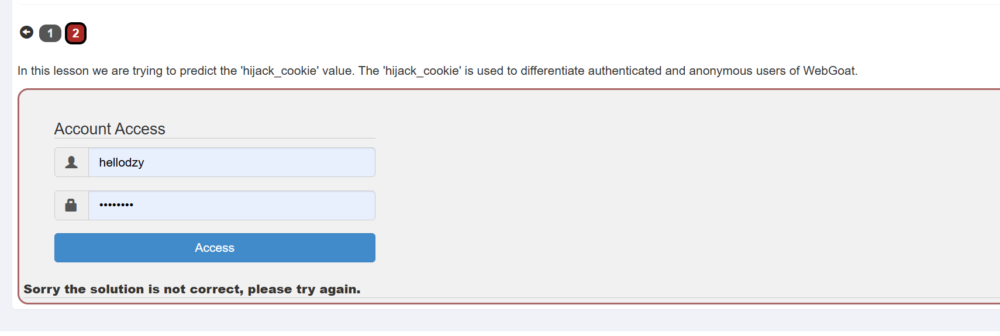
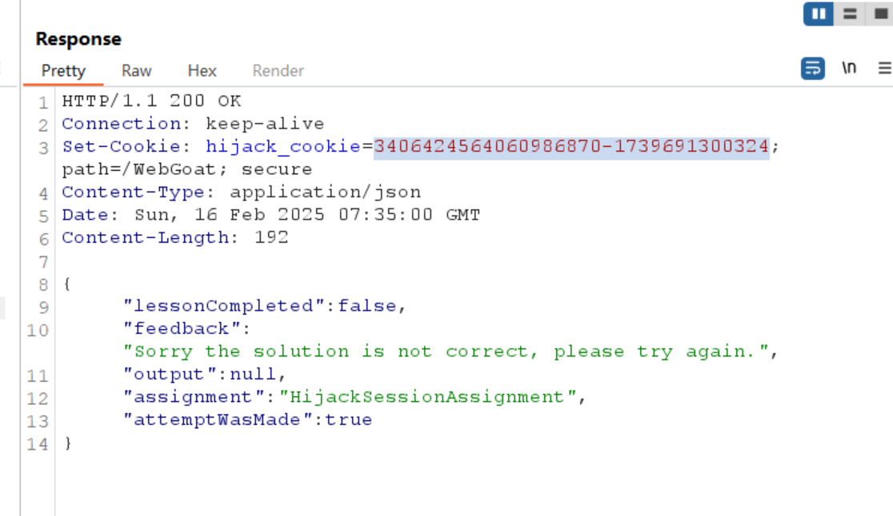
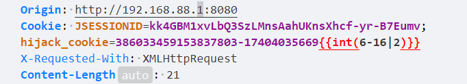
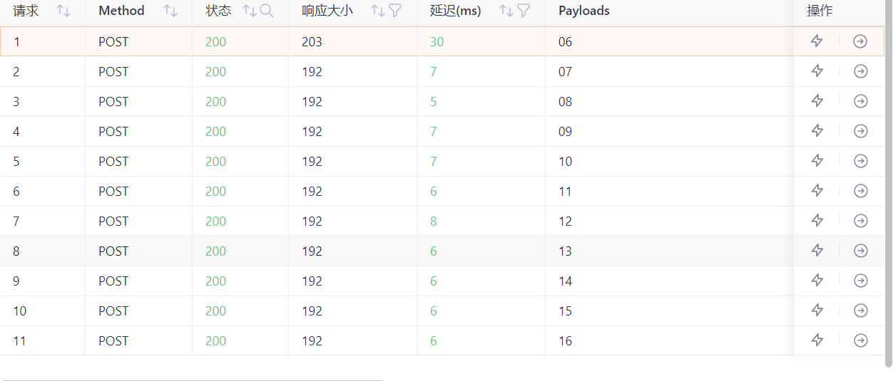
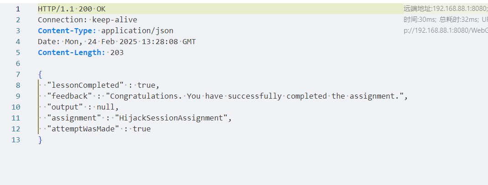

# Hijack a session  


## 要访问已经验证过的用户，要预测'hijack_cookie'的值,它用来区分验证过的用户和匿名用户。  

  

- 用户登录的时候会有一个cookie来认证身份，如果cookie生成的方式比较简单或者有规律就可以预测
  

2. 多发送几次，观察值的变化规律，记录如下，值分为两部分，第一部分递增，第二部分也递增，据说是时间戳。  
```
386033459153837801-1740403566898
386033459153837802-1740403566906
386033459153837804-1740403566916
386033459153837805-1740403566923
386033459153837806-1740403566932
386033459153837807-1740403566940

```  
3. 发现前一部分是递增，后一部分也是递增，但是前一部分没有03结尾的数据，可以爆破他，后一部分是时间戳，使用yakit构造如下  
  

4. 查看响应，有一个长度和其他不一样，很可能就是正确的  
  

5. 点开查看，果然是对的  
  

