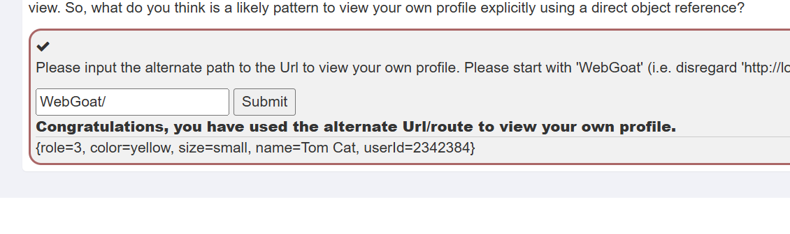

# Insecure Direct Object References  

## 1
不安全的直接对象引用，已经验证的用户可以通过修改参数来访问其他的数据  

## 2  
告诉用户密码，验证身份  

## 3  

有些信息在响应中被包含了，但是并不会在浏览器中显示，要求找出两个不在浏览器中显示的信息。  
点击view profile按钮后，找到拦截的响应  
  
  
role和userId  

## 4  
在服务器的目录下可能会用用户的id建立一个用户的路径，那么可以通过修改id访问其他用户的路径，这里就是要求通过修改id访问自己的路径  

1. 在上一页，请求包中可以看到url,响应包有用户id  

2. 找到了路径直接访问路径下的用户目录  
```
WebGoat/IDOR/profile/2342384
```  
  

## 5  

### View Another Profile  

上一页用了一种方法访问自己的目录，现在要用同样的方法访问别人的目录  

1. 点击之后拦截到一个包
  
请求头中的%7BuserId%7D通过url解码后是{userid}，说明要填一个用户的id，之前得到了自己的id，填入发送看看  
  
响应说你对了，但是请找一个不同的地方  
  

2. 设置爆破，爆破范围视情况而定，我从2342348到2345000  


3. 给响应排序之后找到两个特殊的，有一个是自己的id，还有一个就是成功访问到了其他用户  

  


### Edit Another Profile  
找到了一个其他用户的id，还要修改他的内容  

1. 点击按钮抓包  
  

2. 修改要用put请求，content-type要用application/json，然后用json格式修改变量  

  

3. 关于content-type，可以用application/x-www-form-urlencoded，效果应该是一样的，在登陆请求我用两种方式提交都没有问题，可以正确响应。但是这里不可以，如果用其他格式提交数据，可以看响应怎么说  

  

这里是只接受application/json格式的数据，那么就用这个格式  
