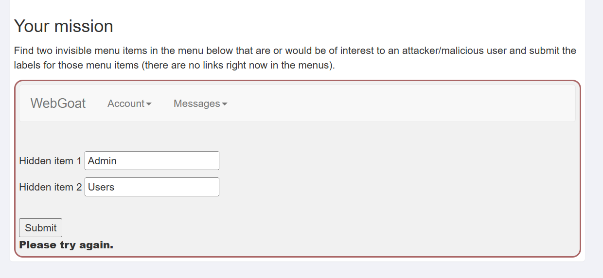
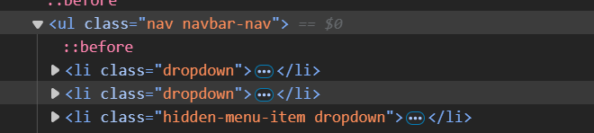
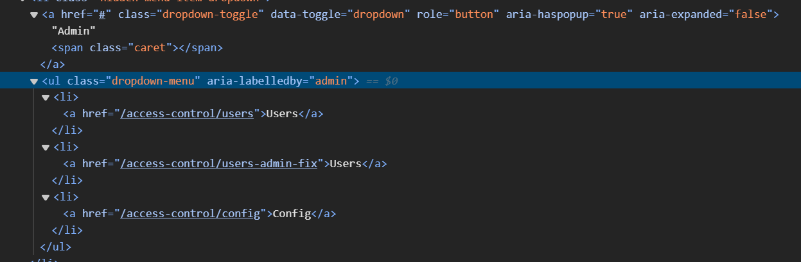
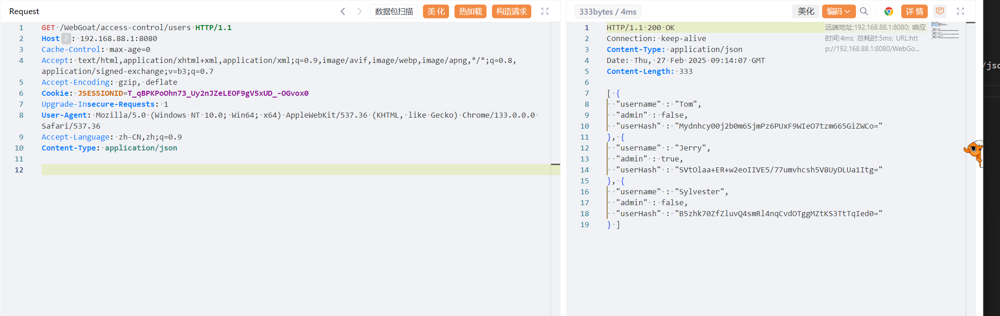
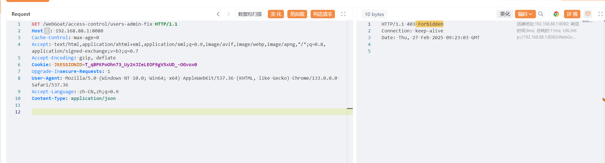
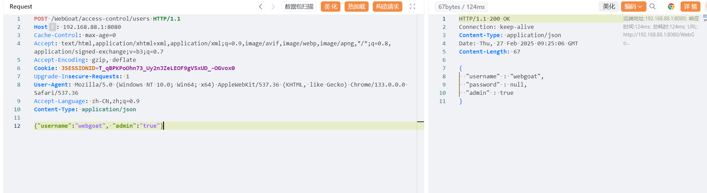
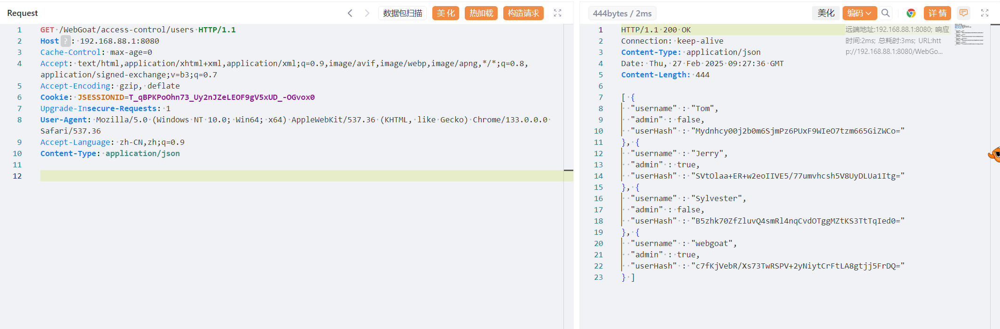
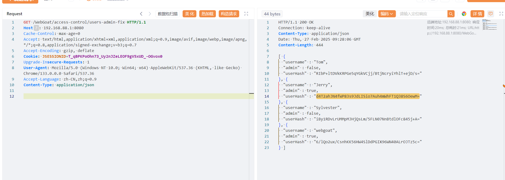
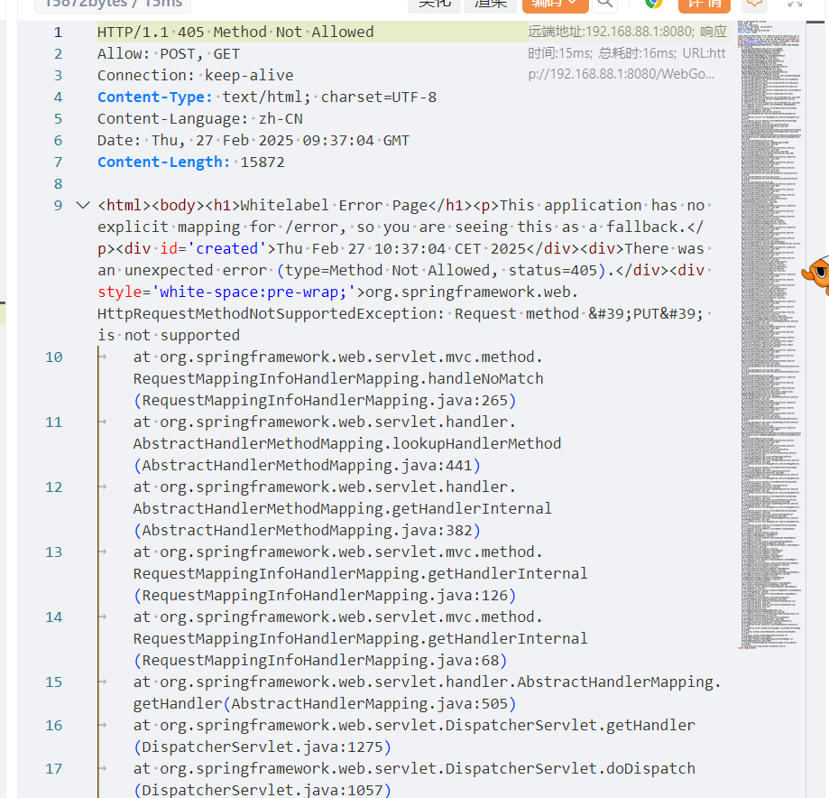

# 2  
有时访问权限的控制是在客户端实现的  
任务是在下面的菜单中找到两个隐藏的选项  
  

1. F12看元素，找到菜单的位置，找到一个疑似隐藏的内容  
  
在dropdown-menu中找到  
  
Users和config

# 3  
有时应用程序控制访问权限在客户端实现，尝试寻找隐藏的内容并看看会发生什么  
之前找到了隐藏的内容，这里要找hash值，隐藏的按钮有两个users,用户的信息可能在里面，但是直接访问却找不到,抓包发现是没有填写content-type,默认是application/x-www-form-urlencoded,但是他是只接受application/json格式，修改之后发送  
  
直接找到了  

# 4  

第二个users会跳到/access-control/users-admin-fix  
直接发送请求会被拒绝  
  

题目说修复了bug，所以只能要管理员才能访问，看之前成功的响应，发现user属性有admin，值是“false",那么我猜测是否可以post一个用户上去，admin设为true，我登录的用户名是webgoat,所以我post的username也设置为webgoat  
  
可以成功提交，再用get看一眼响应，发现多了叫webgoat的用户  
  

再次向/access-control/users-admin-fix发请求，正确的响应了  
  

put请求和post请求都可以修改数据，但是这里只能用post，如果用put，响应是这样的  
  
响应表明只允许post和get请求  

