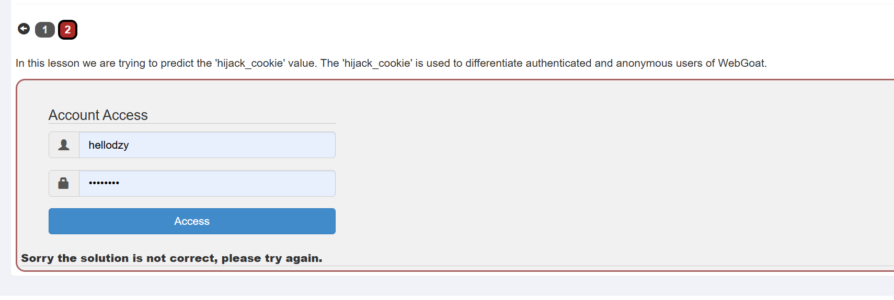
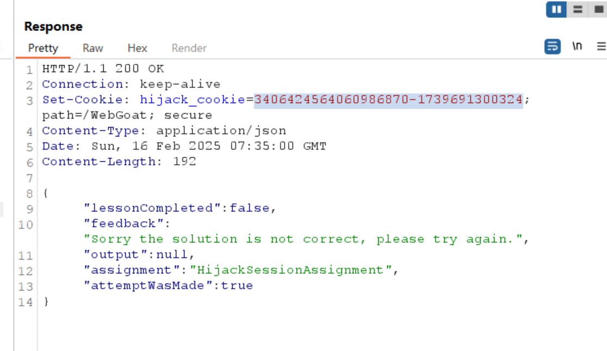
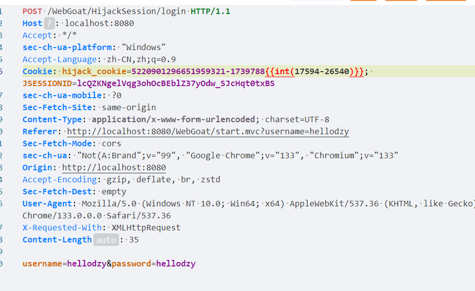

# Hijack a session  


## 要访问已经验证过的用户，要预测'hijack_cookie'的值,它用来区分验证过的用户和匿名用户。  

  

- 用户登录的时候会有一个cookie来认证身份，如果cookie生成的方式比较简单或者有规律就可以预测，大概就是这样。  
1. 发送请求，在响应头中有set-cookie  
  

2. 多发送几次，观察值的变化规律，记录如下，值分为两部分，第一部分递增，第二部分也递增，据说是时间戳。  
```
6782615642430800696-1740030190808  
6782615642430800697-1740030294562  
6782615642430800698-1740030308521
6782615642430800699-1740030317594
6782615642430800701-1740030326540
```  
3. 发现没有6782615642430800700作为第一部分的，那么可以爆破他，第二部分应该介于1740030317594到1740030326540,使用yakit如图设置  
  


