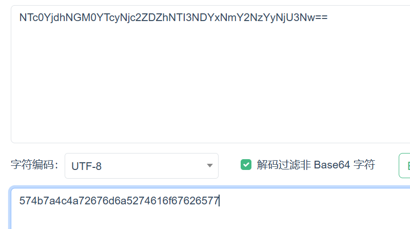
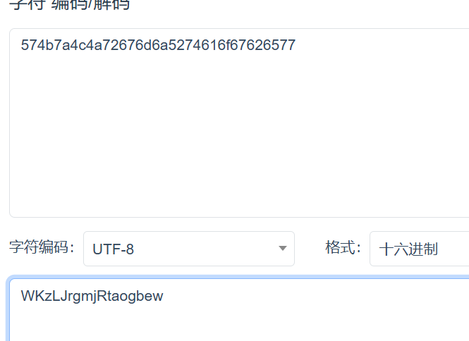
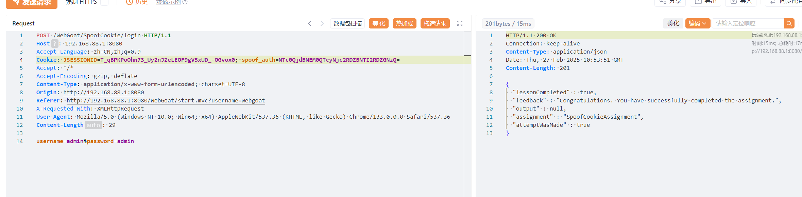

# 1  
cookies在一些需要认证的服务中使用。当一个用户登录后，服务会验证提供的证书，如果证书通过验证，就可以建立会话  
通常每一个对话都有一个唯一的ID用来标记用户对话。当一个服务响应给用户是，响应头可能会包含一个"Set-Cookie"响应头，包括cookie的名字和值  
cookie通常在客户端和服务端都被存储  
一方面，cookie记录在客户端也成为敏感信息，攻击者可以通过开发特定的漏洞，拦截攻击，XSS等获取，另一方面，如果生产cookie的方法被发现，那么推测cookie值也很简单  

# 2  

给了两个可以登录的，登录拿到cookie

登录后显示cookie，疑似base64，拿去解码  
  
看起来是16进制数字，16进制解码  
  
发现后面就是webgoat倒过来  
对admin同样操作，拿到的值放在一起对比  
```
WKzLJrgmjRnimda
WKzLJrgmjRtaogbew
```
推测cookie的生成方式，用户名倒置，接在WKzLJrgmjR后面，那么可以算出tom的cookie，构造后发送  


