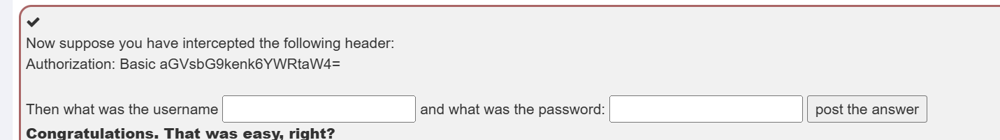
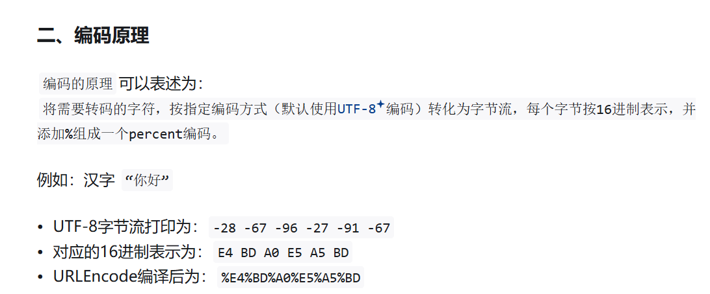
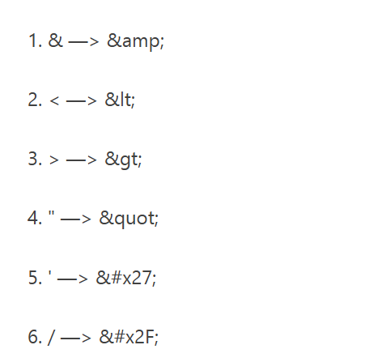
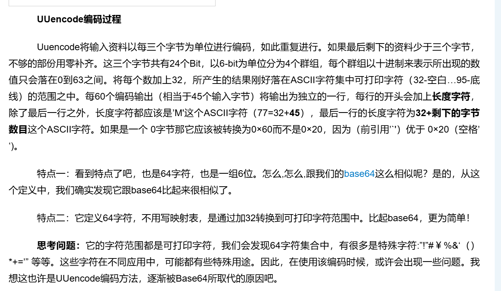
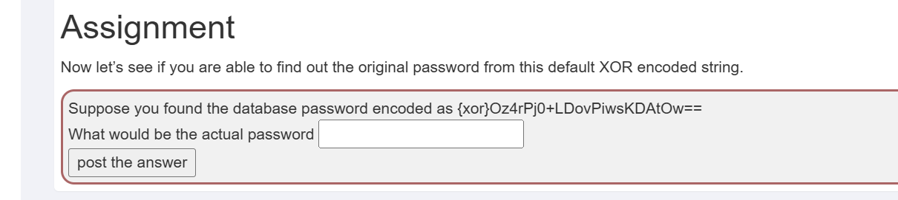
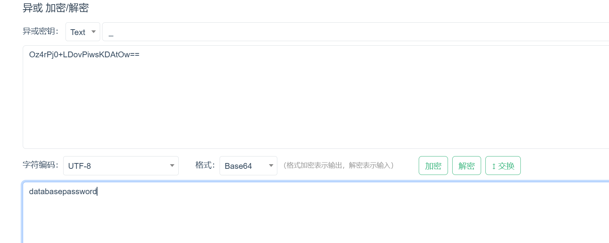
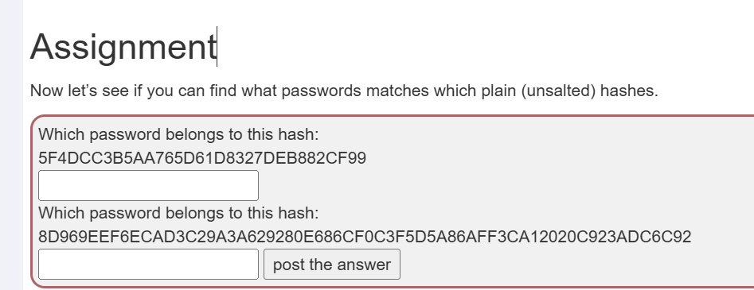
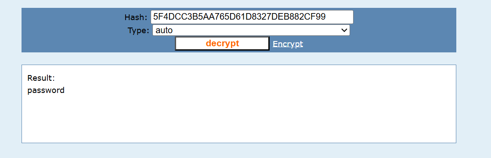
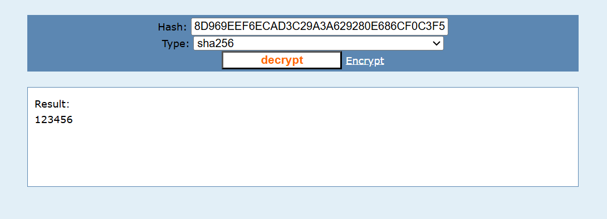

# Base64 Encoding  

base64编码原理  
  
如果多一个字符，那么有八位，补4个0，并且在编码结构后面加两个=，如果多两个，在后面加一个=。  

  
base64解码即可  

# Other Encoding  

## URL encoding  

  
  

## HTML encoding  

据说一般只有一下会编码  

  

## UUEncode  

  

## XOR encoding  

明文的每一位和密钥对应的位异或的结果就是编码的结果  

##  Assignment  

  
直接xor解密，密钥是_,据说这是BM Websphere默认密钥  
  

# Hashing   

## Plain Hashing  
普通哈希，常见MD5,SHA-1等等  

## Salted Hashes  
加盐哈希，据说就是在密码后面加上一些字符后再进行哈希运算。  

## Assignment  

  
用这个解密https://www.cmd5.org/  

  
  
哈希运算不可逆，据说解密原理就是计算大量的常见密码哈希值，然后做成表，如果是这样可能会有解不出来的情况。  

# Encryption  

## Assignment  

