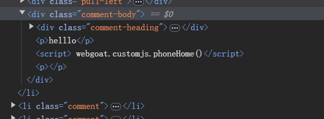

# 1  

上一课学习反射型，这一节学习存储型  

# 2  

Stored XSS Scenario  

- 攻击者发布恶意代码  
- 服务器接收并存储  
- 用户访问页面  
- 恶意代码执行  

# 3  

通过品论注入，最终要调用webgoat.customjs.phoneHome函数  
  

1. 先随便发个评论试试，我发了个hello，发送后评论区多了一条  

  

2. 看看源代码，找到评论区的标签  
  
推测也是直接将评论的内容拼接到代码中  

3. 构造，发送helllo

  
提交，完全融入正常的评论  
  
但是没有什么显示，看源代码，也很好的注入了  

4. 
下面说抓包或者用开发者工具可以找到 'phoneHome Response is …​."的字段，抓包看看  

说明是成功了  

5. F12开发者工具下面找到了  
  

