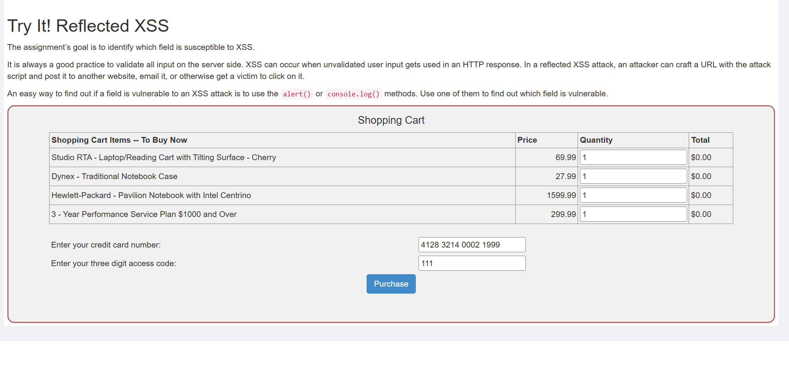
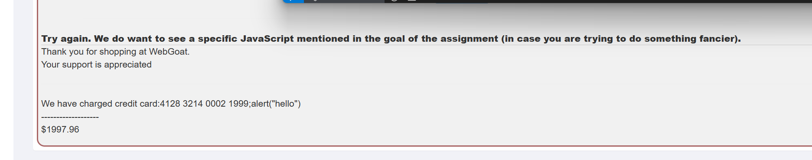

# 1  

## Concept  
描述什么是Cross-Site Scripting(xss)和如何使用它执行开发者原本不想执行的程序  

##  Goals  

- 对xss概念和工作原理的基本了解

- 学习Reflected XSS  

- 展示  
    - Reflected XSS injection  
    - DOM-based XSS injection  

# 2  

xss注入可以获取一些敏感信息，题目问这几个页面的cookie是否是一样的，在每一个页面执行以下alert(document.cookie)发现是一样的  
  

# 3  

罗列了xss攻击的角度，但是我看不太懂  
- Search fields that echo a search string back to the user

- Input fields that echo user data

- Error messages that return user-supplied text

- Hidden fields that contain user-supplied data

- Any page that displays user-supplied data

    - Message boards

    - Free form comments

- HTTP Headers  

# 4  
xss攻击造成的结果  
- 窃取会话cookie  
- 构造错误请求  
- 在网页中构造错误区域收集证书  
- 将页面重定向到危险站点   
- 窃取机密信息  
- 在端系统上执行恶意代码  
- 插入恶意代码  

# 5 
xss类型  

## Reflected  
反射型，也称非持续型

# 6  
Reflected XSS  

攻击者构造恶意url，用户点击后向服务器发送带有恶意代码的请求，服务器解析后响应，可能会将危险代码一起返回给客户端，客户端执行时就会触发恶意代码  

# 7  
要找到一个可以xss注入的位置  
  

1. 随便输入看看什么情况  
  
页面响应  
  
发现回显了card响应  

2. 找到这一段的源代码  
  

猜测是将cardnumber的输入作为字符串拼接后插入html代码中，联想到sql注入闭合引号，这里输入既要闭合引号也要闭合标签   
注入1234"

"  
结果和预想的一样  
  
再看一眼源代码，很好的注入了  
  

3. 不用闭合直接注入，直接输入，也回显了  

再看源代码，发现引号竟然自己闭合了  
  

# 8  
自己攻自己，看不懂  

# 9  
介绍基于DOM的xss攻击  

# 10  

