# 1  
../是上一级目录，../的url编码是%2e%2e%2f，文件名前加上，可以将文件存储在上一级目录  
一般情况文件名不允许包含/，在请求包中修改，存储时就会存储在上一级目录  

# 2  
上传一个文件，要求上传到指定目录  
  

1. 先发送一个  
  
文件发送的路径在目标路径的下一级，那么要在文件名前加../  

2. 修改数据发送后发现，文件名是使用Full Name来命名的，比如Full Name修改，存储文件名也变化了  
  

3. 那么在Full Name内输入时，在前面加上../  
  

# 3  

  

1. 题目说去除了../，过滤掉了，可以用字符重组，在Full Name前加上....//，在中间检测到../会删除，删除后剩下的还是../  

  

# 4  

1. 还是先提交一个图片看看，我提交的叫hello.jpg  
  
发现存储的名字也叫hello.jpg  
2. 需要提交文件的名字以../开头，但是文件名不能包含/，可以拦截请求修改后发送  

3. 将filename的值修改为"../hello.jpg"后发送  
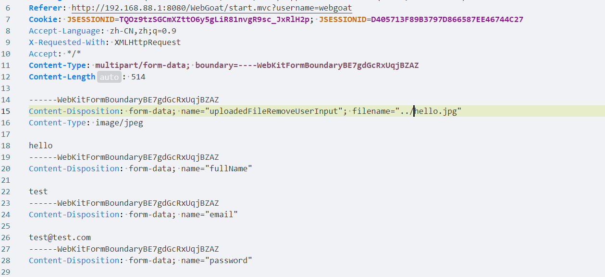  

4.   


# 5  
要找一个path-traversal-secret.jpg的文件  
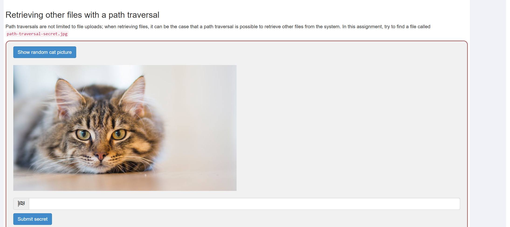  

1. 点击按钮，抓包看看，但是yakit抓不到包，拦截可以拦截到，发送到fuzzer  

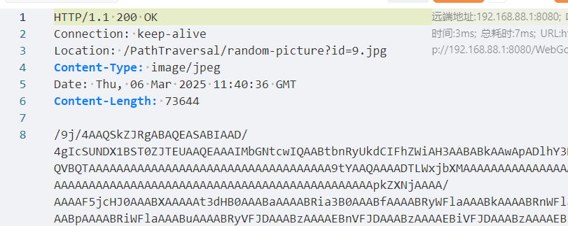  

2. 在响应包中找到参数id=9.jpg，传递参数id=path-traversal-secret.jpg  
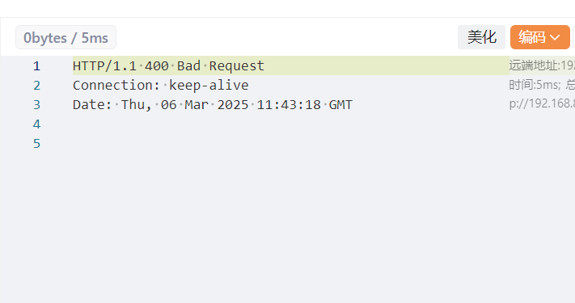  
返回400  

3. 尝试发送id=2.jpg  
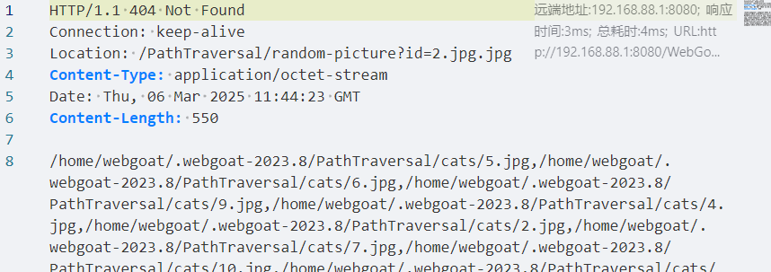  
响应返回id=2.jpg.jpg,但是竟然没有返回400，说明id的值会自动加上后缀  

4. 发送id=path-traversal-secret，发现还是返回400  
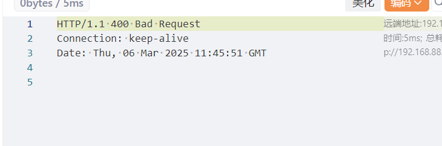  

5. 查看上一级，id=../path-traversal-secret  

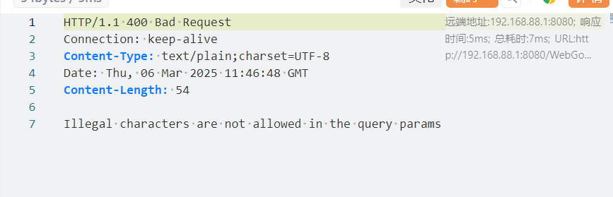  

响应中提示Illegal characters are not allowed in the query params，在查询参数中有非法字符，肯定是../

6. url编码后发送  
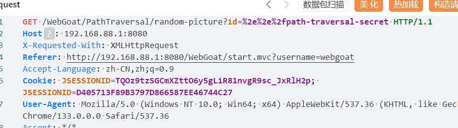  
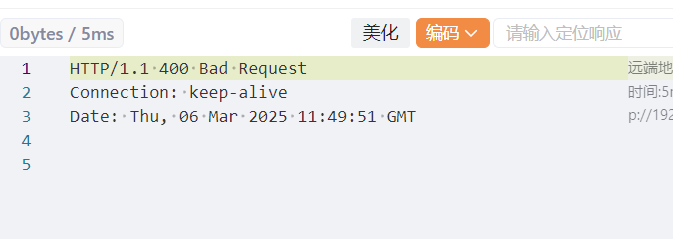  
返回400，但是没有非法字符提示  

7. 再上一级试试  
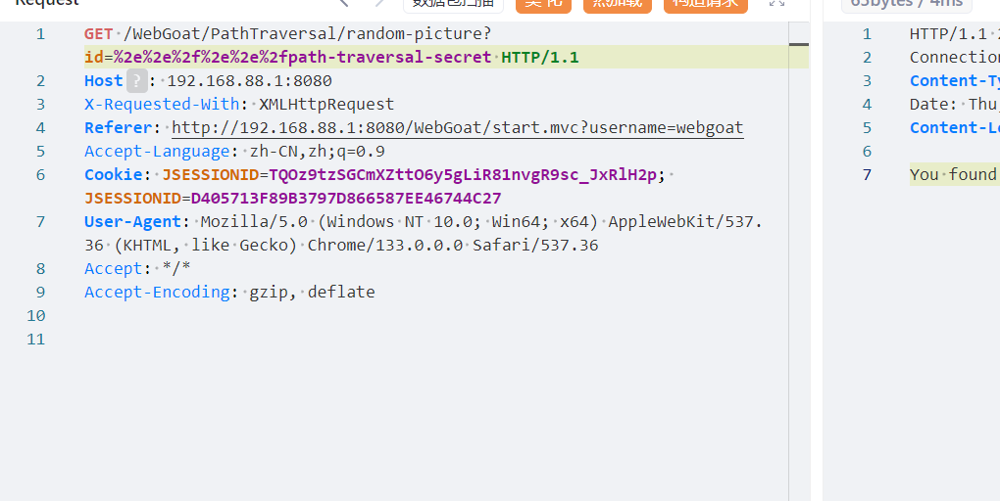  
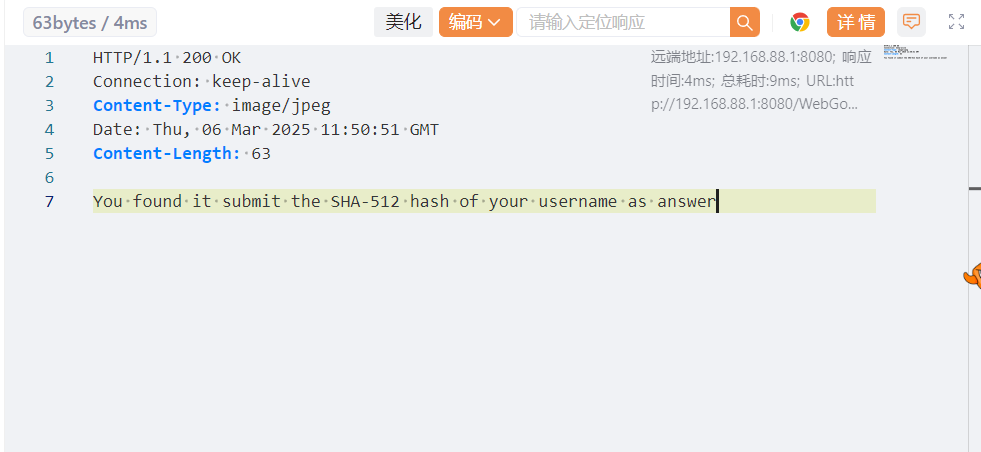  
响应说我的用户名的sha-512哈希值就是答案  

8. 使用sha-512在线计算工具计算得出答案  
  

# 6  

## Zip Slip  
现在必须提交一个zip文件，题目说上传zip文件之后会提取zip文件，要覆盖一个路径下的文件  

  

如果压缩后的文件名以../开头，就可以访问到上一级目录  

1. 用下面的python代码生成一个zip文件  
```python
import zipfile

with zipfile.ZipFile("webgoat.zip","w",zipfile.ZIP_DEFLATED) as zipobj:
    zipobj.write("hello.jpg","../webgoat.jpg",zipfile.ZIP_DEFLATED)

```  
2. 运行之后多了一个webgoat.zip文件，将它上传  


3. 发现是后缀打错了，然后有试了试，发现好像有问题  
  
从返回中看到依然在tmp目录下，貌似../被当作了文件名的一部分  

4. 不过我大胆猜测，页面显示的路径并不是真正的路径，而是原本应该存储的路径拼接上解压出文件名的路径，那么可以推测，../../可以访问根目录，然后就可以访问到要去的路径，那么最后生成zip文件的脚本如下  
```py
import zipfile

with zipfile.ZipFile("webgoat.zip","w",zipfile.ZIP_DEFLATED) as zipobj:
    zipobj.write("hello.jpg","../../home/webgoat/.webgoat-2023.8/PathTraversal/webgoat/webgoat.jpg",zipfile.ZIP_DEFLATED)

```  

5. 运行后提交生成的zip，成功  
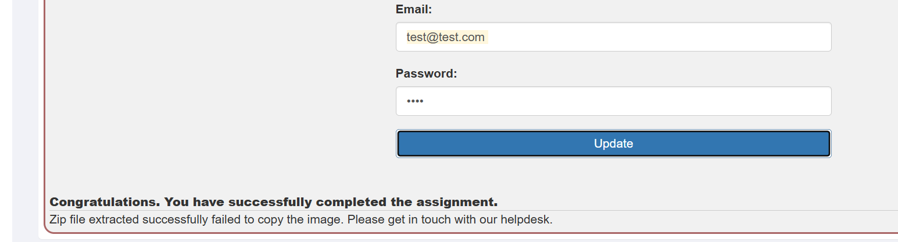  

