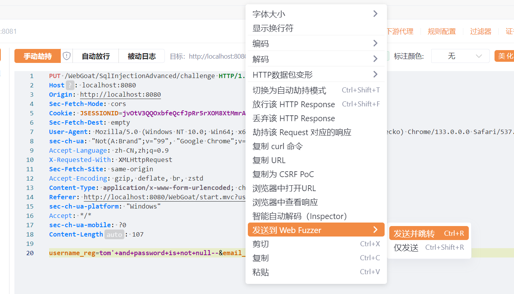
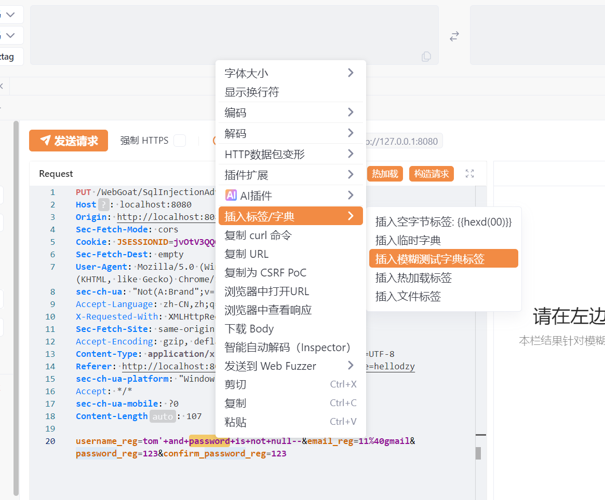
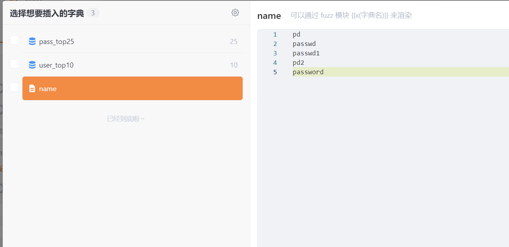

# 1  

# 2  


# 3  
一直一个表要查另一个表的全部信息  

  

1. 直接用下面语句注入  

```  
d'; select * from user_system_data;--
```  
  

2. 使用union，前后查询的数据类型要对应  
```
d' union select userid,user_name,password,password,password,password,userid from user_system_data;--
```  

  


# 4  
介绍了盲注和基于时间的盲注。  


# 5  

要以tom的身份登录，虽然题目是大写，但实际上是小写。  

  

1. 在register界面注册tom，提示已经注册过  
  
说明在注册之前，肯会在数据库中查找是否已经存在相同的用户名，也许可以注入。  

2. 当用户名为(tom' and '1'='1)时，提示已经存在，当用户名为(tom' and '1'='2)时，提示注册好了，可以登录。  

  


说明如果查询为真，那么提示已经存在，如果为假的，那么提示创建好了。  

3. 已经知道tom是存在的，那么肯定也存了他的密码，那么要看密码是用什么名字存的，用以下方式注入  
```
tom' and password is not null--
```  
存密码不一定使用password，也可能是别的名字。这里就是password，并且提示已经存在了。如果没猜对，可以尝试字典爆破。  

4. 关于如何用yakit爆破  
- (1) 发送拦截请求，发送到fuzzer  
  

- (2) 选择字段，然后如图  
  

- (3) 然后选择字典，如果自己的字典没有导入，点击齿轮添加。我的字典是name，事实我没有字典，我就想试试。  
  

- (4) 点击插入，然后发送请求


