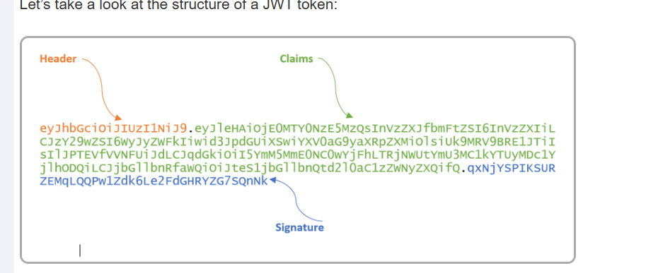
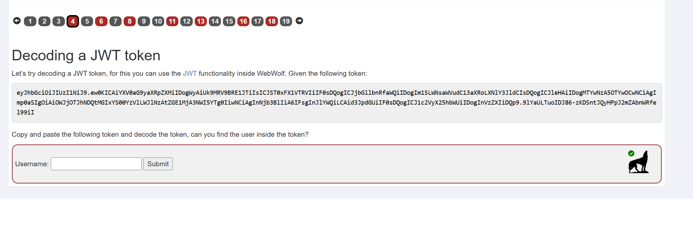
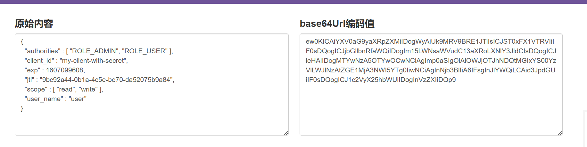
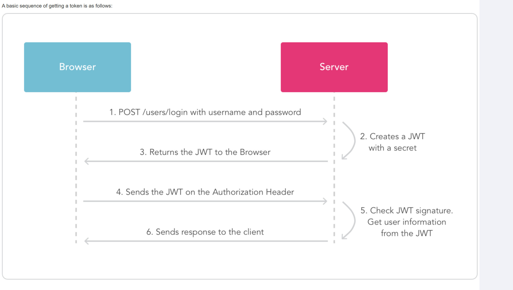
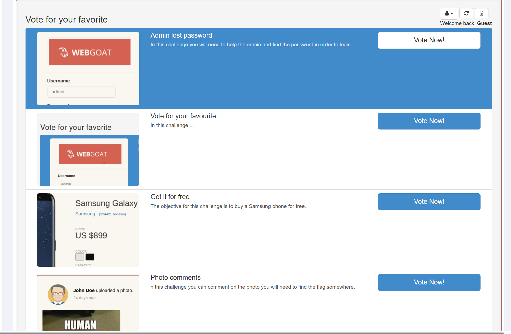
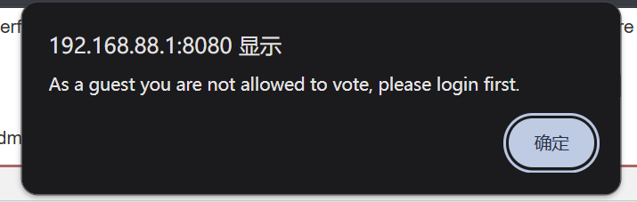
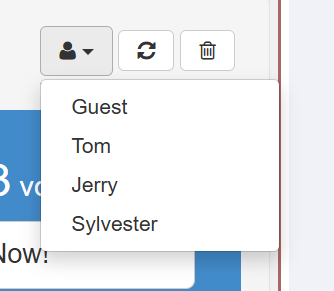
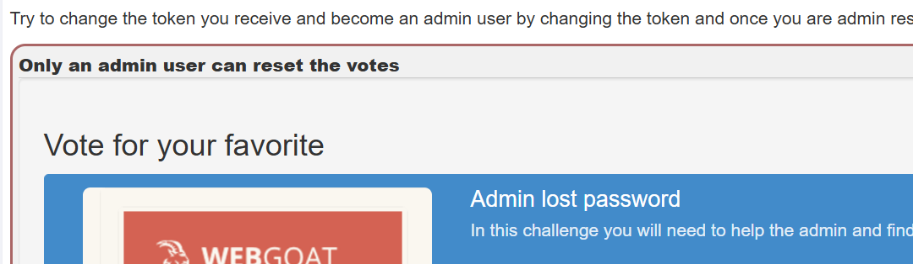
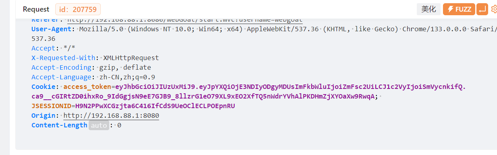
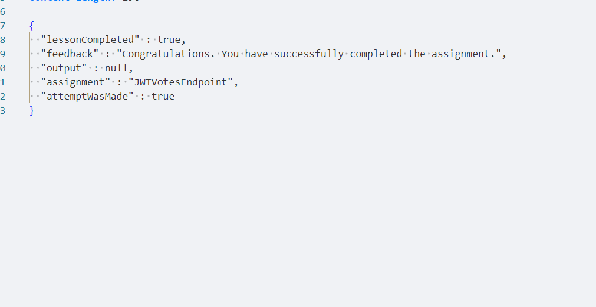

# JWT  

- JSON Web Token（JWT）是一个开放标准（RFC 7519），它定义了一种紧凑且自包含的方式，用于以 JSON 对象的形式在各方之间安全地传输信息。这些信息可以通过数字签名进行验证和信任。JWT 可以使用秘密（使用 HMAC 算法）或 RSA 或 ECDSA 的公钥/私钥对进行签名。  

# JWT使用情景  

1. 用户登录后授权，登录后的请求都包含JWT  
2. 各方安全传输，JWT可以被签名  

# JWT结构  

JWT分为Header,Payload,Signature桑部分，由点号分隔  
  

## Header  

Header通常包含两部分，类型和签名方法，如下所示  
```json
{
  "alg": "HS256",
  "typ": "JWT"
}
```  
经过base64url编码后成为第一部分  

## Payload  

通常包含声明，声明是对实体，通常是用户和附件数据的陈述。声明有三种类型，registered,pubilic,private  

1. Registered claims  

由IANA通过在IANA JSON Web Token Registry中注册的预定义声明，具有明确的语义和通用性  

2. Public claims  

未被IANA注册在IANA JSON Web Token Registry中，由其他公开协议或行业标准定义，需要使用命名空间或者向IANA注册来避免冲突  

3. Private claims  
在用以使用该声明的各方中使用的自定义声明，没有注册也没有也不是公开声明  

通过base64url编码后组成第二部分  

- 声明描述信息举例，registered claims  
```
iss（Issuer）：签发者。

sub（Subject）：主题（如用户 ID）。

exp（Expiration Time）：过期时间（Unix 时间戳）。

iat（Issued At）：签发时间。
```  
如  
```json  
{
  "sub": "1234567890",
  "name": "John Doe",
  "admin": true,
  "exp": 1516239022
}
```

## Signatrue  

使用header中指定的方法，用密钥对Header.Payload签名，签名是对base64url编码后的数据签名，而不是原始的json数据  

# JWT claim misuse  

对jwt中claim的不当操作  

- 添加原本未授权的声明，比如添加管理员权限  
- 修改声明的值  
- 过度声明，添加过多元素增加JWT大小，干扰系统性能或引起其他问题  
- 修改声明过期时间（exp）,延长JWT 
- 重复JWT，修改JWT中的信息冒充其他用户  
- 关键声明操纵，如修改“kid”（key ID）来使用不同的密钥进行签名  

# Decoding a JWT token  

给了一个JWT，询问username的值  

JWT的payload部分可能包含该信息，将其解码之后可能会发现，解码后查看结果  
  

username的值就是user  

# Authentication and getting a JWT token  

1. 用户首先向服务器发送带有用户名和密码的请求  
2. 服务器认证通过后，建立一个新的JWT和一个密钥
3. 服务器返回JWT给用户浏览器  
4. 再次请求时，请求头的Authorization带有JWT  
5. 服务器检查JWT签名并获取用户信息  
6. 服务器响应用户请求  
  

 
 # JWT signing  
 任何JWT都应该在发给用户之前签名，如果不签名就可能被修改内容，在任何其他操作之前都应该先认证签名  

# HS512  
HS512是基于HMAC和SHA-512的组合，HMAC是一种用于验证数据完整性和真实性的技术，结合了哈希函数  
- 以HS512的过程具体说明  
    - 密钥处理  
    如果密钥长度过长，比如sha-512的块是128字节，如果大于于这个值，就进行哈希运算，如果之后小于128字节，就会延长，通常是补零  
    - 临时密钥  
    HMAC使用两个不同的常量，ipad(inner padding),定值为0x36,opad(outer padding),0x5c,先将这两个值各自重复128次，形成128字节的块，再使用这两个值对密钥进行异或运算，得到两个临时密钥，分别为key_ipad和key_opad  
    - 两次哈希  
    第一次哈希（inner hash）将key_ipad与原始内容拼接后计算出sha-512的哈希值  
    第二次哈希（outer hash）将key_opad与第一次的哈希结果拼接后计算sha-512的哈希值  
    - 第二次哈希的结果就是最终签名  


 # Assignment  
 需要修改token的内容，把自己变成一个admin user  

   


点击任何vote按钮，弹窗  
  

右上角有可以切换的用户，用除Guest以外的方式登录后可以投票  

  

点击垃圾桶出现提示  
  

1. 投一票抓个包  
  
cookie中的access_token有两个点分隔，是JWT的结构  

2. 把前两部分解码  
header 
```
{"alg":"HS512"}
```
payload  
``` 
{"iat":1742288205,"admin":"false","user":"Jerry"}
```  

将admin的值修改为true，然后编码  
```
eyJpYXQiOjE3NDIyODgyMDUsImFkbWluIjoidHJ1ZSIsInVzZXIiOiJKZXJyeSJ9
```

3.然后就要修改签名，header部分alg的值为HS512  


4. 不知道密码，签名算法的值可以是"none"，将其修改之后编码，那么签名的结果为空，{"alg":"none"}编码结果为  
```
eyJhbGciOiJIUzUxMiJ9
```  
新的JWT为
```
eyJhbGciOiJIUzUxMiJ9.eyJpYXQiOjE3NDIyODgyMDUsImFkbWluIjoidHJ1ZSIsInVzZXIiOiJKZXJyeSJ9.  
```  
注意最后的点要留下  

5. 修改后发送  
  

# Solution  
最初JWT库出现的时候，会严格按照header中的算法运算，算法可以被修改为"none"，一些库会信任该值并不做检查，还有一种情况，如果把alg的值由"RS256"修改为"HS256"，会尝试使用HMAC-SHA256,并把RSA的公钥作为HMAC的密钥来认证  

# JJWT  

JJWT（Java JWT）是一个用于在 Java 应用中创建、解析和验证 JSON Web Tokens（JWT） 的开源库。它提供了一套简单且符合标准的 API，帮助开发者轻松处理 JWT 相关的操作，适用于身份验证、授权和信息安全交换等场景。  


## Header类  
io.jsonwebtoken.Header,运行直接设置一个完整的头部对象  

- Jwts.header() 方法创建实例
```java  
Header header = Jwts.header();
```  
- setAlgorithm() 设置签名算法  
- setType()  设置类型，通常为"JWT"  

## Claims类  
io.jsonwebtoken.Claims  

- Jwts.claims()方法创建实例  
- set类方法  
  - setIssuer()设置签发者
  - setExpiration()设置过期时间  
  - setSubject()设置主题  
  - put("A","B"),自定义，增加名为A的元素，值为"B"
- get类方法 
  - getIssuer()获取签发者，返回String对象  
  - getSubject()获取zhuti，返回String对象  
  - getExpiration()获取过期时间，返回Date对象  
  - get()获取自定义


## JWT构建器  

Jwts.builder()返回一个JwtBuilder对象  
```java
JwtBuilder builder = Jwts.builder();  
```  

1. 配置header  

- setHeaderParam(String key, Object value)，返回一个JwtBuilder对象，支持链式调用，value必须是JSON兼容的简单类型如字符串数字等  

- setHeader（Header header）直接设置完整的头部对象（自定义或已有 Header 返回一个JwtBuilder对象  


2. 配置Payload  
- setClaims(Claims claims),设置完整的声明集合（覆盖已有的声明,返回JwtBuilder  
- claim(String key, Object value)添加单个声明（如 sub, iss, exp 等）。返回JwtBuilder。  

3. 签名  
- signWith(Key key)，返回JwtBuilder  
- signWith(SignatureAlgorithm alg, Key key)返回JwtBuilder   

4. 生成JWT字符串  
compact(),返回完整JWT字符串  


## 解析器  

- Jwts.parser()方法创建解析器  
```java  
JwtParser parser = Jwts.parser();
```

- parser.setSigningKey()配置签名密钥，返回JwtParser,可以链式调用
- parser.requireIssuer()验证Issuer是否等于传入一个字符串  
- parseClaimsJws() 传入一个字符串，解析并验证是否是有效的JWT,返回一个Jws<Claims>类常  
- parse()解析但不验证JWT是否有效，

parseClaimsJws()必须验证签名，若签名无效、令牌过期或结构错误，会抛出 JwtException 子类异，parse不必验证签名，即使签名部分为空也可以接受  

## Jws<Claims>类  

已解析的Jws类  


# Code review  

已解析的JWT  
```json
{
  "alg" : "none",
  "typ" : "JWT"
},
{
  "admin" : true,
  "iat" : 1516239022,
  "sub" : "1234567890",
  "user" : "John Doe"
}
```  
1. 
```java  
try {
   Jwt jwt = Jwts.parser().setSigningKey(JWT_PASSWORD).parseClaimsJws(accessToken);
   Claims claims = (Claims) jwt.getBody();
   String user = (String) claims.get("user");
   boolean isAdmin = Boolean.valueOf((String) claims.get("admin"));
   if (isAdmin) {
     removeAllUsers();
   } else {
     log.error("You are not an admin user");
   }
} catch (JwtException e) {
  throw new InvalidTokenException(e);
}
```  
parseClaimsJws()必须要验证签名，在原JWT中签名算法的值为"none"，无法被解析，抛出异常  

2. 
```java
try {
   Jwt jwt = Jwts.parser().setSigningKey(JWT_PASSWORD).parse(accessToken);
   Claims claims = (Claims) jwt.getBody();
   String user = (String) claims.get("user");
   boolean isAdmin = Boolean.valueOf((String) claims.get("admin"));
   if (isAdmin) {
     removeAllUsers();
   } else {
     log.error("You are not an admin user");
   }
} catch (JwtException e) {
  throw new InvalidTokenException(e);
}
```  
parse()解析而不验证签名，故不会抛出异常，会执行removeAllUsers()方法  


