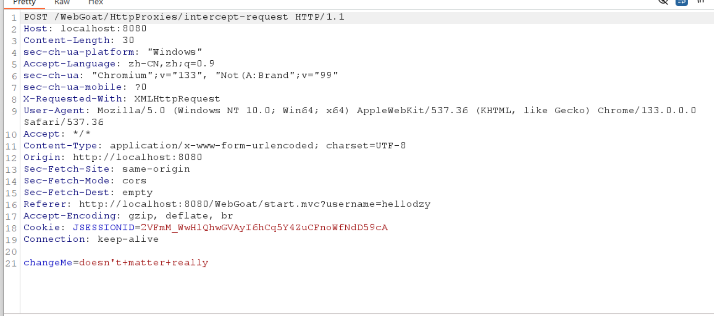
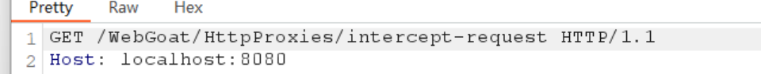

# HTTP Basics  

## 魔法数字是什么  
1. 随便填，然后抓包  
  
  
2. POST传的第一个参数就是，填进去点go  

# HTTP Proxies

  

1. burpsuit开启拦截，然后点击Submit
  
  

2. 按照要求修改  
- Change the Method to GET  
  

- Add a header 'x-request-intercepted:true'  
  

- Remove the request body and instead send 'changeMe' as a query string parameter and set the value to 'Requests are tampered easily' (without the single quotes)
  
把最后一行删除  
3. 但是发现有问题，警觉空格要用url编码  
  
并且最后一行不能删除  
  
4. 改好之后发送，响应很好  
  

# Developer Tools  

## Using the console  
要调用一个函数，然后填入一个随机数，该数字会被输出  
  
直接调用  

## 找一个特殊HTTP请求，然后找networkNum  
  
1. 题目要用Network tab来完成，F12，html代码一点点找，找到了对应位置form标签，想必这就是要发送的请求，里面有一个input标签，名字是networkNum，后面有值。  
  

2. 也可以拦截请求，按照要求点一下GO按钮，拦截查看  
  

# CIA Triad  
CIA三要素：机密性，完整性，可用性(confidentiality, integrity, availability)。  

# Writing new lesson  

怎么在webgoat中添加新课程，我就不看了。  

