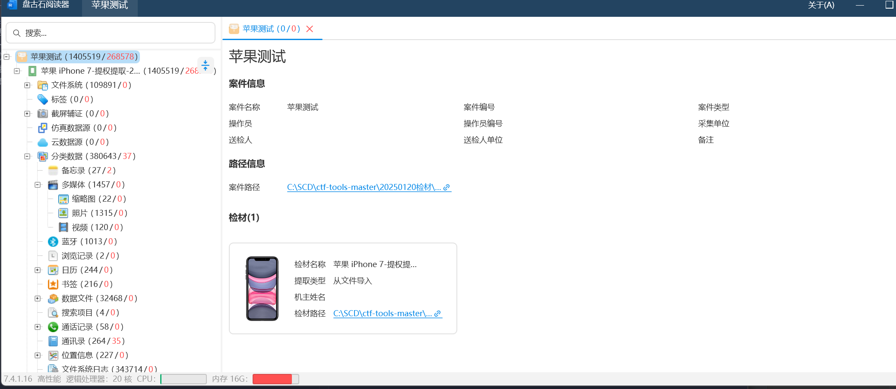
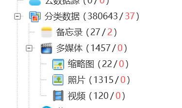
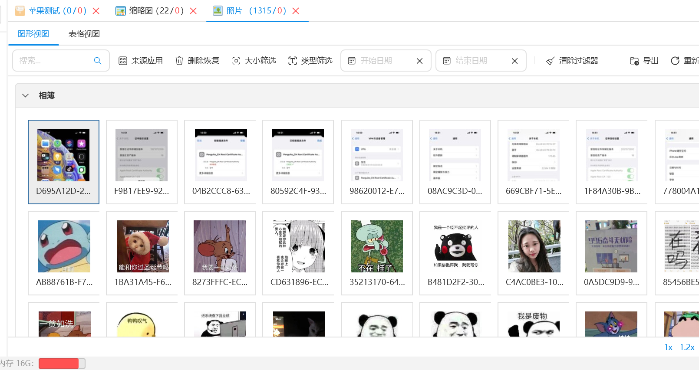
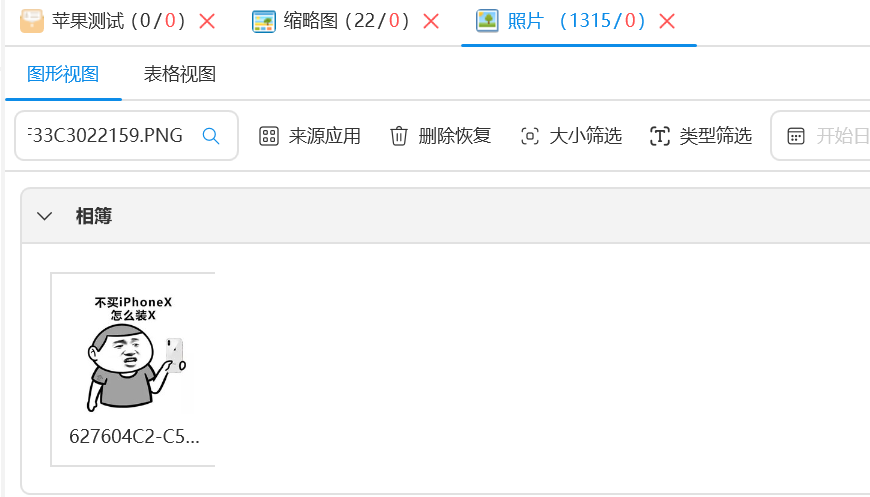
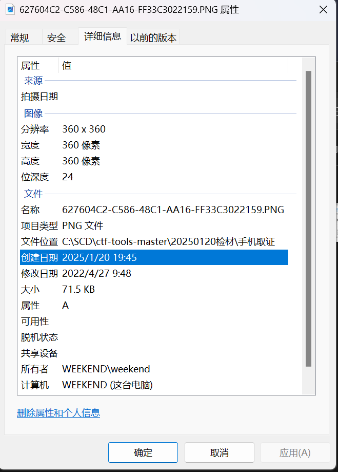

# 题目描述  
现对一个苹果手机进行取证，请您对以下问题进行分析解答。  
627604C2-C586-48C1-AA16-FF33C3022159.PNG图片的分辨率是？（答案参考格式：1920×1080）  
注意：中间为乘号×，不是字母x  
最大尝试次数：3次  
检材解压密码：0ba6b2c094cbb3a04681a135487a19cb  

# WP
1. 解压文件 一直解压打开苹果测试.exe  
  

2. 题目问一个图片的分辨率，在左侧多媒体中找到了和图有关的路径  
  

3. 打开照片，发现有个搜索  
  

4. 搜一下题目中的名字  

5. 然后查看一下分辨率，但是看不到，可以导出到本地，右键属性详细信息可以看到。  

