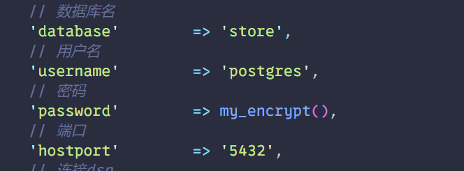

# 题目描述
请提交数据库连接的明文密码。（答案参考格式：abcABC123）  

# WP

1. 题目说找数据库的密码，在WWW/application里面找到一个database.php的文件 
发现密码是my_encrypt()的返回值  



2. 发现application下有一个文件夹叫encrtpt，打开发现encrypt.php，  
``` php
<?php
function my_encrypt(){
    $str = 'P3LMJ4uCbkFJ/RarywrCvA==';
    $str = str_replace(array("/r/n", "/r", "/n"), "", $str);
    $key = 'PanGuShi';
    $iv = substr(sha1($key),0,16);
    $td = mcrypt_module_open(MCRYPT_RIJNDAEL_128,"",MCRYPT_MODE_CBC,"");
    mcrypt_generic_init($td, "PanGuShi", $iv);
    $decode = base64_decode($str);
    $dencrypted = mdecrypt_generic($td, $decode);
    mcrypt_generic_deinit($td);
    mcrypt_module_close($td);
    $dencrypted = trim($dencrypted);
    return $dencrypted;
}
```  

3. 然后运行代码，可以用在线网站运行，注意php7.1.0之后的版本不支持mcrypt_module_open()函数  

