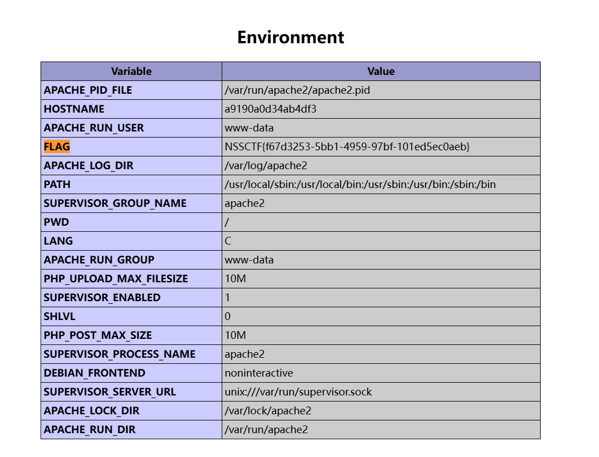

# WP  
1. 上传一个php代码，编写一个php文件上传，但是要上传图片，所以写一个php代码后修改后缀。这题看phpinfo()的信息。  
2. 用burpsuit拦截请求报文，把filename的后缀修改回.php，然后sent  
  
3. 上传之后发现文件保存在./upload/路径下，可以找到上传的php文件的位置是/upload/hello.php

4. 访问后搜索flag  
  