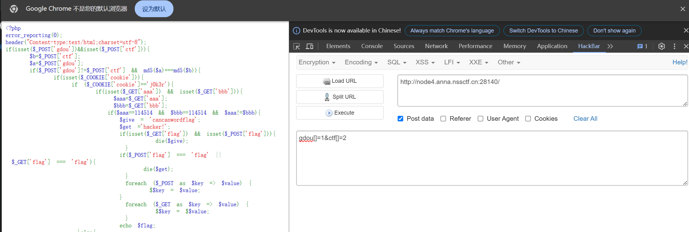
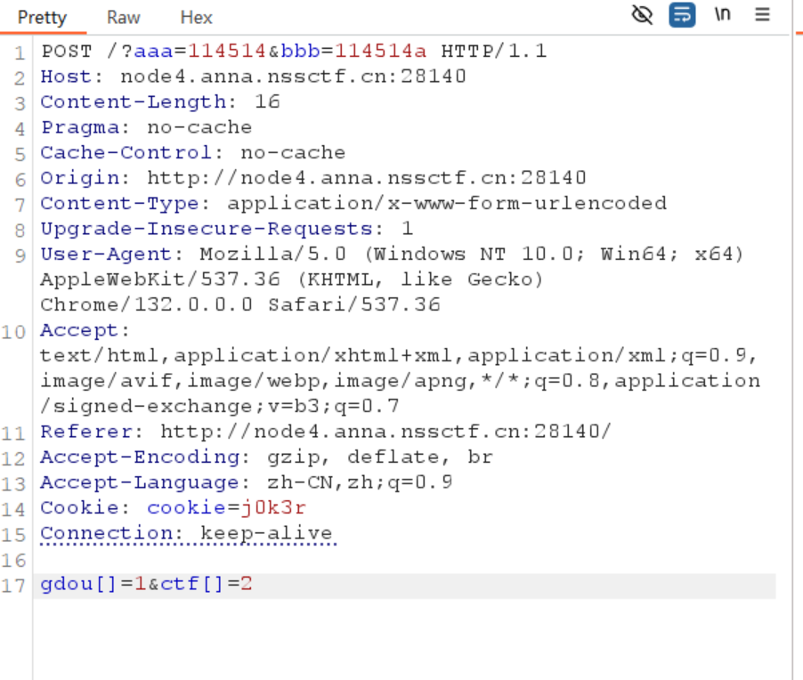
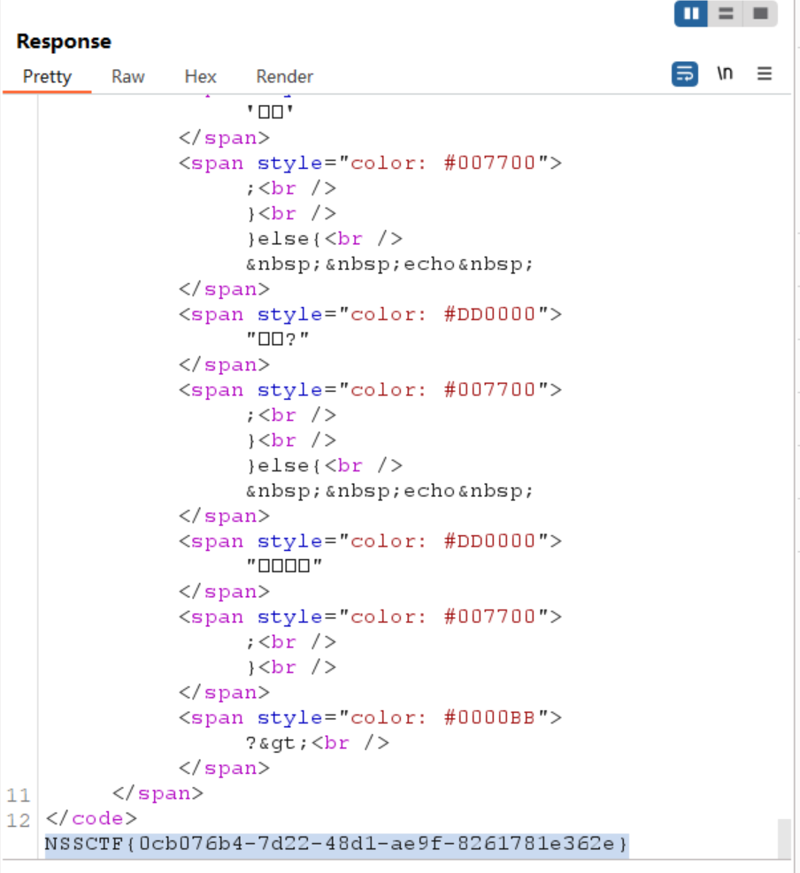

# 题目  
```php
<?php
error_reporting(0);
header("Content-type:text/html;charset=utf-8");
if(isset($_POST['gdou'])&&isset($_POST['ctf'])){
    $b=$_POST['ctf'];
    $a=$_POST['gdou'];
    if($_POST['gdou']!=$_POST['ctf'] && md5($a)===md5($b)){
        if(isset($_COOKIE['cookie'])){
           if ($_COOKIE['cookie']=='j0k3r'){
               if(isset($_GET['aaa']) && isset($_GET['bbb'])){
                  $aaa=$_GET['aaa'];
                  $bbb=$_GET['bbb'];
                 if($aaa==114514 && $bbb==114514 && $aaa!=$bbb){
                   $give = 'cancanwordflag';
                   $get ='hacker!';
                   if(isset($_GET['flag']) && isset($_POST['flag'])){
                         die($give);
                    }
                   if($_POST['flag'] === 'flag' || $_GET['flag'] === 'flag'){
                       die($get);
                    }
                    foreach ($_POST as $key => $value) {
                        $$key = $value;
                   }
                    foreach ($_GET as $key => $value) {
                         $$key = $$value;
                    }
                   echo $flag;
            }else{
                  echo "洗洗睡吧";
                 }
    }else{
        echo "行不行啊细狗";
        }
  }
}
else {
  echo '菜菜';
}
}else{
  echo "就这?";
}
}else{
  echo "别来沾边";
}
?>
别来沾边
```  

# WP
1. 用post传gdou和ctf，要求值不同但是md5相同，可以用碰撞或者数组绕过，cookie告诉了直接加，aaa和bbb弱比较
2. hackbar传值，好像有编码的问题但是可以后面改

3. 添加cookie，get传递参数后发送  

