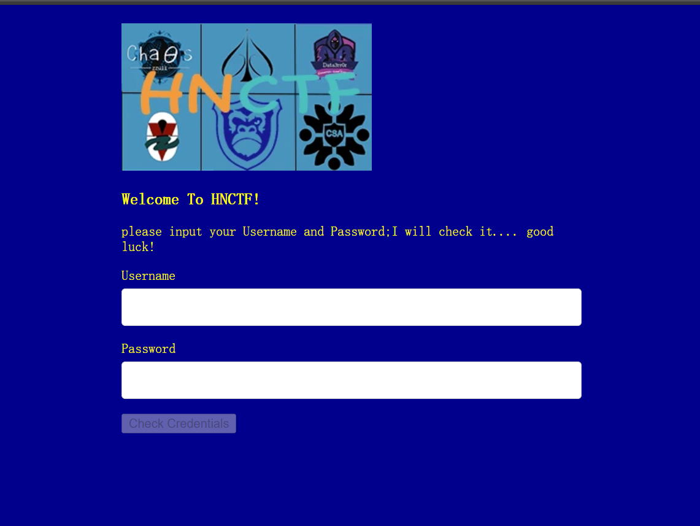
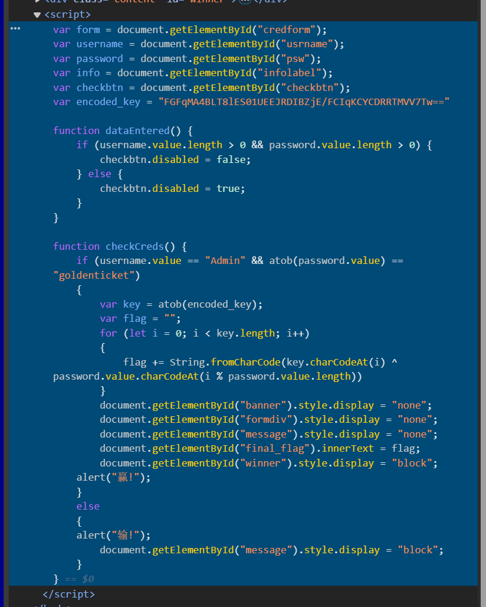
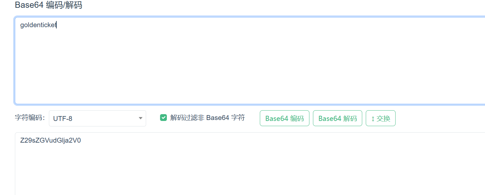
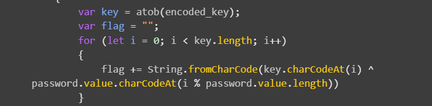
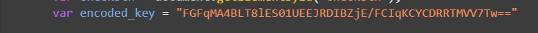

# 题目  
一个html文件和两个图片  

# WP  
1. 用浏览器打开html  
  

2. 在源码中找到script代码  
  

3. atob函数是base64编码，btoa是解码，代码就是用户名是Admin,密码解码后是goldenticket  

4. 在线base64编码解码  
  

5. 输入用户名密码得到flag  
  

6.  其实可以发现，flag是一下代码生成，所有的变量都是已知的，可以直接算  
  
encoded_key在前面  
  
