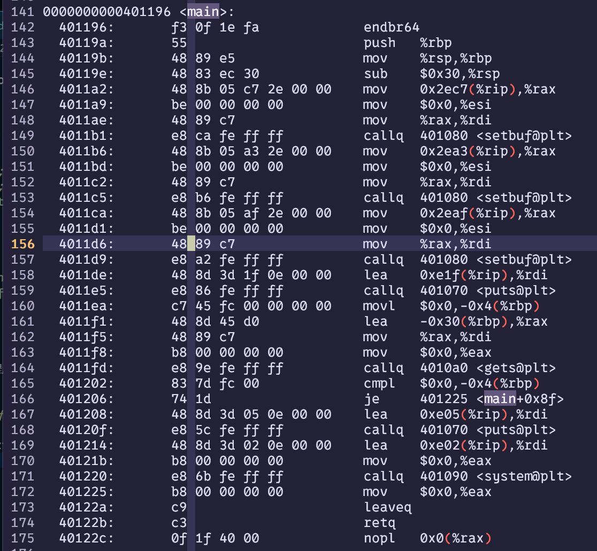

# WP  
1. cn进去之后说Input something,随便输入之后退出了，下载附件发现有一段C代码如下  
```c
#include<stdio.h>
int main()
{
    setbuf(stdin,0);
    setbuf(stdout,0);
    setbuf(stderr,0);
    puts("Input something");
    char name[30];
    int number=0;
    gets(name);
    if(number!=0){
        puts("You win.");
        system("cat flag");
    }
    return 0;
}
```
2. 推测环境内直接执行该程序，并且只要number不为零，就会执行cat flag，number的值为0，有gets函数，利用栈溢出修改number的值。
3. 
```
objdump -d easy_overflow > overflow.txt
```
反汇编后打开overflow.txt,看main函数部分  
  
4. 
第164行调用gets函数，%rdi为参数，往前看发现发现%rdi的值是-0x30+M(%rbp),在第160行把-0x4+M(%rbp)设为0，结合上下文可以确定number的位置是-0x4+M(%rbp),两者间隔44个字节，那么只要输入45个字符即可  
5. 输入44个1不行，输入45个可以，说明我完全正确  
  