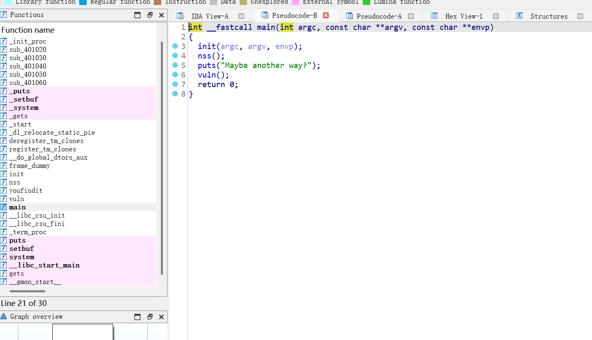
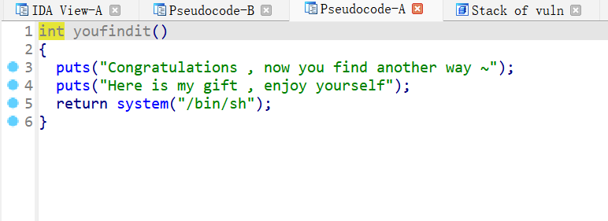
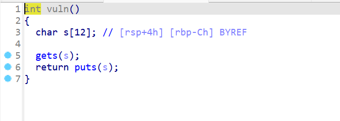
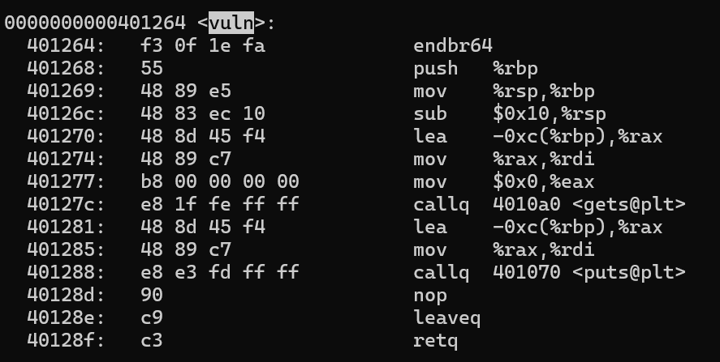
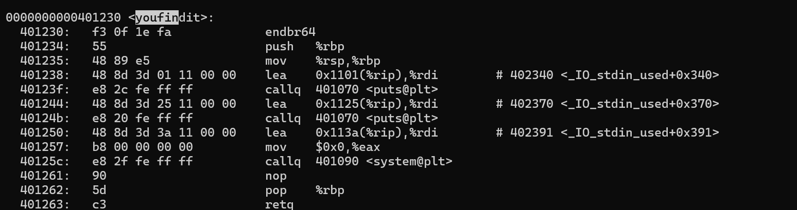
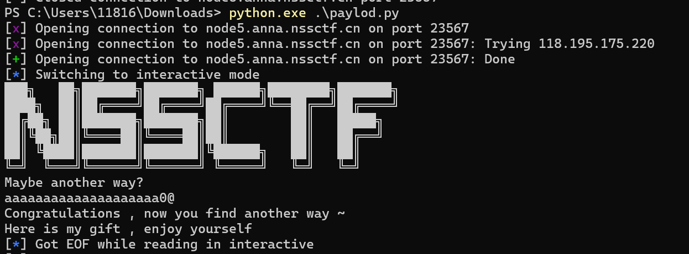

1. 用ida打开文件  

  
- 在左侧发现一个函数叫youfindit，点击查看  

发现调用了system函数，可以用过栈溢出来调用  

- 调用了nss函数和vuln函数，查看发现在vuln函数中调用了gets函数，可以使用栈溢出  
  

2. 使用 objdump -d .\FindanotherWay > out.txt 将反汇编代码保存到out.txt中，然后找到vuln函数  

  

call vuln是会将返回地址压入栈，要修改的就是这8个字节，%rbp是栈顶的地址，也是8字节，读取位置是-0xc(%rbp),有12字节，所以总共有28个字节，要修改的是最后八个字节  

3. 看youfindit函数的地址  

401230

4. 所以要输入20个字节，然后后面八个字节的16进制是401230，但是这样就有许多不可打印字符，无法直接输入，python的pwntools库可以远程链接并且16进制输入。
```python
from pwn import *

p = remote("node5.anna.nssctf.cn",23567)

ret = 0x401250
input = b'a'*20 + p64(ret)
p.sendline(input)
p.interactive()  
```  
remote是远程连接  
p64()和p32()的作用分别是传入一个数字参数转变为64位和32位  
interactive()的作用是拿到shell后交互  


5. 运行完后报错Got EOF while reading in interactive  
  
也有Congratulations等，说明是成功调用了youfindit()  
后来查了一下，Ubuntu有些版本在调用system函数时，%rsp的值必须是16的倍数。我推测，从401230进入函数，就会执行push %rbp，如果从这个地址之后的地址进入函数，那么执行到system时，相比之前rsp的值就减少了8，并且通过我的尝试，确实在401230进入之后都可以  

