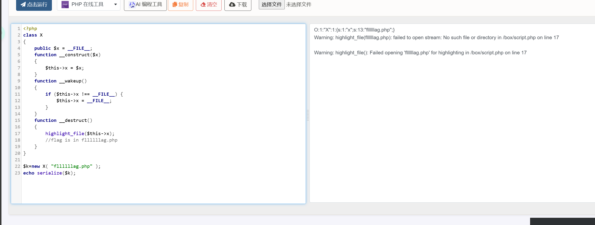
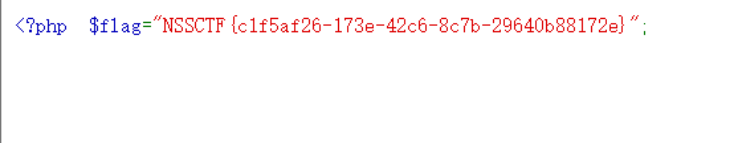

# 题目
```php
<?php
class X
{
    public $x = __FILE__;
    function __construct($x)
    {
        $this->x = $x;
    }
    function __wakeup()
    {
        if ($this->x !== __FILE__) {
            $this->x = __FILE__;
        }
    }
    function __destruct()
    {
        highlight_file($this->x);
        //flag is in fllllllag.php
    }
}
if (isset($_REQUEST['x'])) {
    @unserialize($_REQUEST['x']);
} else {
    highlight_file(__FILE__);
}
```
# WP
1. 题目已经说明flag的位置，wakeup函数会在反序列化前调用，会将类内部的x的值修改为当前路径，在类销毁时会显示路径x，hilight_file会显示路径文件的内容，所以要传入x的值为flag的位置，并且要绕过wake。
2. 构造出需要的x，并且将其序列化
  
3. 传入参数x的值为O:1:"X":1:{s:1:"x";s:13:"fllllllag.php";}，第二个1表示成员数量，修改为2后与实际成员数量不同会绕过。  

