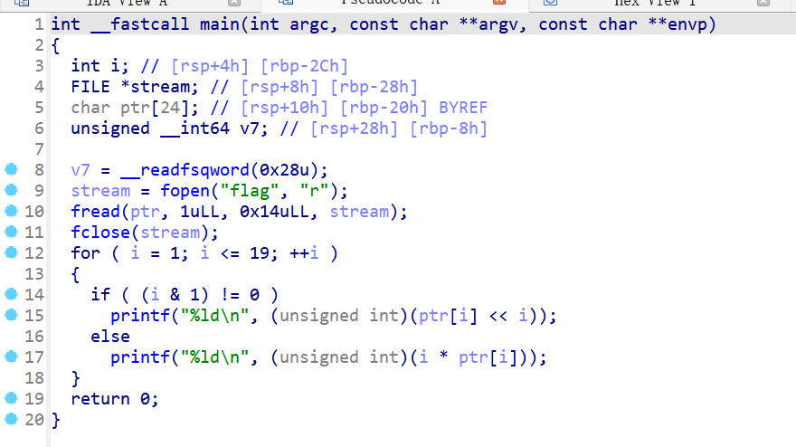
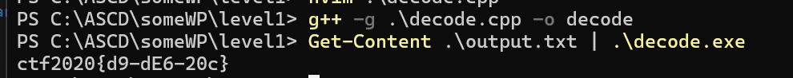

给一个level1文件和一个output.txt，output内容如下  
```
198
232
816
200
1536
300
6144
984
51200
570
92160
1200
565248
756
1474560
800
6291456
1782
65536000
```  
# wp  

1. ida打开level1,F5看伪代码  
  
stream读取flag内容，然后存到ptr数组，加密后输出，  

2. 想必output.txt就是加密后的内容，解密就是flag  

3. 编写解密代码  
```c++
#include <iostream>
using namespace std;
int main()
{
    for(int i=1;i<=19;++i)
    {
        long long s=0;
        cin>>s;
        if((i&1)!=0){
            s>>=i;
        }else{
            s/=i;
        }
        cout<<(char)s;
    }
    return 0;
}

```  

4. 运行得到falg  


