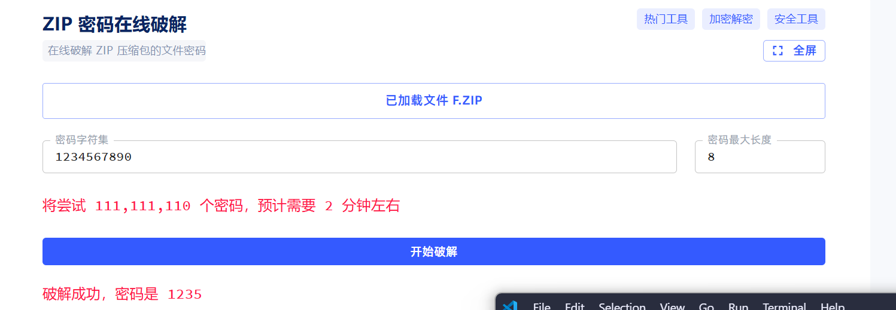
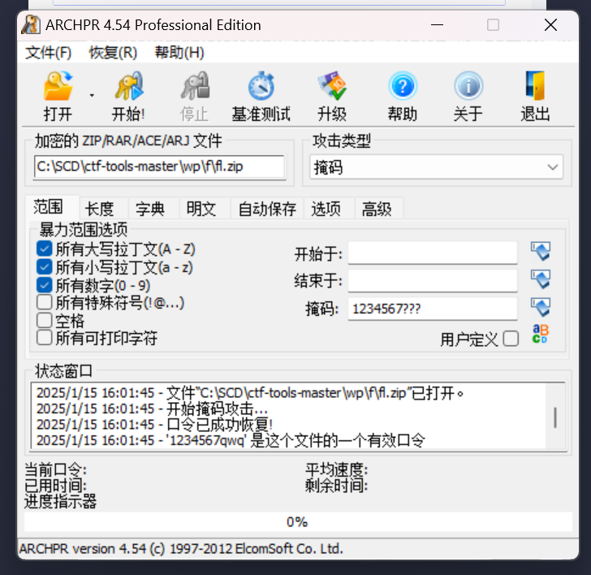
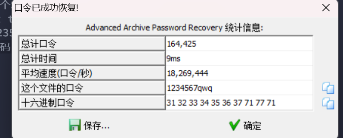
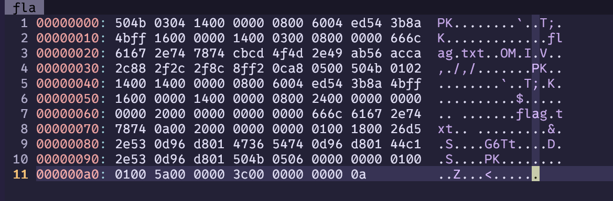

# 题目
一个zip文件  

# WP  

1. 第一层，直接暴力,用zip密码破解网站  
  
密码1235  

2. 打开密码.txt，前锁定前7位，枚举后3位,掩码攻击,用ARCHPR

密码: 1234567qwq  

3. 最后是伪加密，用vim打开，但是vim不能打开zip文件，但是把文件名后缀.zip删除就可以打开了  
  
然后就是把第二个5040开始，后面第9和第10个字节改成00，保存退出就可以了，解压就有了。
